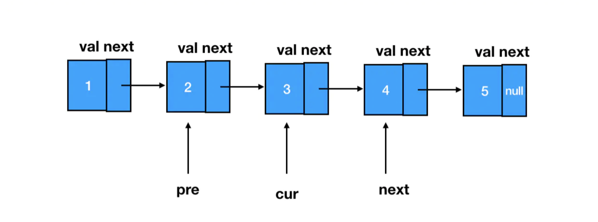
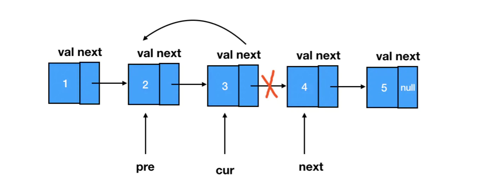

# LeetCode 算法精选(2)

[[toc]]

## 206. 反转链表

给你单链表的头节点 head ，请你反转链表，并返回反转后的链表。

```text
输入：head = [1,2,3,4,5]
输出：[5,4,3,2,1]

输入：head = [1,2]
输出：[2,1]
```

解题：



cur.next = pre



```js
/**
 * @param {ListNode} head
 * @return {ListNode}
 */
const reverseList = function (head) {
  // 初始化前驱结点为 null
  let pre = null;
  // 初始化目标结点为头结点
  let cur = head;
  // 只要目标结点不为 null，遍历就得继续
  while (cur !== null) {
    // 记录一下 next 结点
    let next = cur.next;
    // 反转指针
    cur.next = pre;
    // pre 往前走一步
    pre = cur;
    // cur往前走一步
    cur = next;
  }
  // 反转结束后，pre 就会变成新链表的头结点
  return pre;
};
```

## 235. 二叉搜索树的最近公共祖先

::: tip 题目

输入: root = [3,5,1,6,2,0,8,null,null,7,4], p = 5, q = 1  
输出: 3  
解释: 节点 5 和节点 1 的最近公共祖先是节点 3。

输入: root = [3,5,1,6,2,0,8,null,null,7,4], p = 5, q = 4  
输出: 5  
解释: 节点 5 和节点 4 的最近公共祖先是节点 5。因为根据定义最近公共祖先节点可以为节点本身。

:::

```js
/**
 * 二叉树结点的结构定义如下
 * function TreeNode(val) {
 *     this.val = val;
 *     this.left = this.right = null;
 * }
 */
/**
 * @param {TreeNode} root
 * @param {TreeNode} p
 * @param {TreeNode} q
 * @return {TreeNode}
 */
const lowestCommonAncestor = function (root, p, q) {
  // 编写 dfs 逻辑
  function dfs(root) {
    // 若当前结点不存在（意味着无效）或者等于p/q（意味着找到目标），则直接返回
    if (!root || root === p || root === q) {
      return root;
    }
    // 向左子树去寻找p和q
    const leftNode = dfs(root.left);
    // 向右子树去寻找p和q
    const rightNode = dfs(root.right);
    // 如果左子树和右子树同时包含了p和q，那么这个结点一定是最近公共祖先
    if (leftNode && rightNode) {
      return root;
    }
    // 如果左子树和右子树其中一个包含了p或者q，则把对应的有效子树汇报上去，等待进一步的判断；否则返回空
    return leftNode || rightNode;
  }

  // 调用 dfs 方法
  return dfs(root);
};
```

- 若有效汇报个数为 2，直接返回当前结点
- 若有效汇报个数为 1，返回 1 所在的子树的根结点
- 若有效汇报个数为 0，则返回空（空就是无效汇报）

## 232. 用栈实现队列

::: tip 题目

请你仅使用两个栈实现先入先出队列。队列应当支持一般队列支持的所有操作（push、pop、peek、empty）：

实现 MyQueue 类：

void push(int x) 将元素 x 推到队列的末尾
int pop() 从队列的开头移除并返回元素
int peek() 返回队列开头的元素
boolean empty() 如果队列为空，返回 true ；否则，返回 false
说明：

你 只能 使用标准的栈操作 —— 也就是只有 push to top, peek/pop from top, size, 和 is empty 操作是合法的。
你所使用的语言也许不支持栈。你可以使用 list 或者 deque（双端队列）来模拟一个栈，只要是标准的栈操作即可。

:::

```js
/**
 * 初始化构造函数
 */
const MyQueue = function () {
  // 初始化两个栈
  this.stack1 = [];
  this.stack2 = [];
};

/**
 * Push element x to the back of queue.
 * @param {number} x
 * @return {void}
 */
MyQueue.prototype.push = function (x) {
  // 直接调度数组的 push 方法
  this.stack1.push(x);
};

/**
 * Removes the element from in front of queue and returns that element.
 * @return {number}
 */
MyQueue.prototype.pop = function () {
  // 假如 stack2 为空，需要将 stack1 的元素转移进来
  if (this.stack2.length <= 0) {
    // 当 stack1 不为空时，出栈
    while (this.stack1.length !== 0) {
      // 将 stack1 出栈的元素推入 stack2
      this.stack2.push(this.stack1.pop());
    }
  }
  // 为了达到逆序的目的，我们只从 stack2 里出栈元素
  return this.stack2.pop();
};

/**
 * Get the front element.
 * @return {number}
 * 这个方法和 pop 唯一的区别就是没有将定位到的值出栈
 */
MyQueue.prototype.peek = function () {
  if (this.stack2.length <= 0) {
    // 当 stack1 不为空时，出栈
    while (this.stack1.length != 0) {
      // 将 stack1 出栈的元素推入 stack2
      this.stack2.push(this.stack1.pop());
    }
  }
  // 缓存 stack2 的长度
  const stack2Len = this.stack2.length;
  return stack2Len && this.stack2[stack2Len - 1];
};

/**
 * Returns whether the queue is empty.
 * @return {boolean}
 */
MyQueue.prototype.empty = function () {
  // 若 stack1 和 stack2 均为空，那么队列空
  return !this.stack1.length && !this.stack2.length;
};
```

## 239. 滑动窗口最大值

给你一个整数数组 nums，有一个大小为 k 的滑动窗口从数组的最左侧移动到数组的最右侧。你只可以看到在滑动窗口内的 k 个数字。滑动窗口每次只向右移动一位。

输入: nums = [1,3,-1,-3,5,3,6,7], 和 k = 3 输出: [3,3,5,5,6,7]

1 [3 -1 -3] 5 3 6 7  
1 3 [-1 -3 5] 3 6 7  
1 3 -1 [-3 5 3] 6 7  
1 3 -1 -3 [5 3 6] 7  
1 3 -1 -3 5 [3 6 7]

最大值分别对应：3 3 5 5 6 7

思路分析：双指针+遍历法

```js
/**
 * @param {number[]} nums
 * @param {number} k
 * @return {number[]}
 */
const maxSlidingWindow = function (nums, k) {
  // 缓存数组的长度
  const len = nums.length;
  // 定义结果数组
  const res = [];
  // 初始化左指针
  let left = 0;
  // 初始化右指针
  let right = k - 1;
  // 当数组没有被遍历完时，执行循环体内的逻辑
  while (right < len) {
    // 计算当前窗口内的最大值
    const max = calMax(nums, left, right);
    // 将最大值推入结果数组
    res.push(max);
    // 左指针前进一步
    left++;
    // 右指针前进一步
    right++;
  }
  // 返回结果数组
  return res;
};

// 这个函数用来计算最大值
function calMax(arr, left, right) {
  // 处理数组为空的边界情况
  if (!arr || !arr.length) {
    return;
  }
  // 初始化 maxNum 的值为窗口内第一个元素
  let maxNum = arr[left];
  // 遍历窗口内所有元素，更新 maxNum 的值
  for (let i = left; i <= right; i++) {
    if (arr[i] > maxNum) {
      maxNum = arr[i];
    }
  }
  // 返回最大值
  return maxNum;
}
```

`calMax` 可以直接用 `Math.max`

解法二：双端队列法

```js
/**
 * @param {number[]} nums
 * @param {number} k
 * @return {number[]}
 */
const maxSlidingWindow = function (nums, k) {
  // 缓存数组的长度
  const len = nums.length;
  // 初始化结果数组
  const res = [];
  // 初始化双端队列
  const deque = [];
  // 开始遍历数组
  for (let i = 0; i < len; i++) {
    // 当队尾元素小于当前元素时
    while (deque.length && nums[deque[deque.length - 1]] < nums[i]) {
      // 将队尾元素（索引）不断出队，直至队尾元素大于等于当前元素
      deque.pop();
    }
    // 入队当前元素索引（注意是索引）
    deque.push(i);
    // 当队头元素的索引已经被排除在滑动窗口之外时
    while (deque.length && deque[0] <= i - k) {
      // 将队头元素索引出队
      deque.shift();
    }
    // 判断滑动窗口的状态，只有在被遍历的元素个数大于 k 的时候，才更新结果数组
    if (i >= k - 1) {
      res.push(nums[deque[0]]);
    }
  }
  // 返回结果数组
  return res;
};
```

## 349. 两个数组的交集

::: tip 题目

输入：nums1 = [1,2,2,1], nums2 = [2,2]  
输出：[2]

输入：nums1 = [4,9,5], nums2 = [9,4,9,8,4]  
输出：[9,4]

:::

```js
const intersect = function (nums1, nums2) {
  nums1.sort((a, b) => a - b);
  nums2.sort((a, b) => a - b);
  let l = 0,
    r = 0,
    ans = [];
  while (l < nums1.length && r < nums2.length) {
    if (nums1[l] === nums2[r]) {
      ans.push(nums1[l]);
      l++;
      r++;
    } else {
      nums1[l] < nums2[r] ? l++ : r++;
    }
  }
  return ans;
};
```

## 350. 两个数组的交集 II

::: tip 题目

输入：nums1 = [1,2,2,1], nums2 = [2,2]  
输出：[2,2]

输入：nums1 = [4,9,5], nums2 = [9,4,9,8,4]  
输出：[4,9]

:::

排序，然后用双指针法。如果是多个数组，可以用多指针法 :rocket:

```js
let intersect = function (nums1, nums2) {
  nums1.sort((a, b) => a - b);
  nums2.sort((a, b) => a - b);
  let l = 0,
    r = 0,
    ans = [];
  while (l < nums1.length && r < nums2.length) {
    if (nums1[l] === nums2[r]) {
      ans.push(nums1[l]);
      l++;
      r++;
    } else {
      nums1[l] < nums2[r] ? l++ : r++;
    }
  }
  return ans;
};
```

## 509. 斐波那契数

::: tip 题目

斐波那契数 （通常用 F(n) 表示）形成的序列称为 斐波那契数列 。该数列由 0 和 1 开始，后面的每一项数字都是前面两项数字的和。也就是：

F(0) = 0，F(1) = 1
F(n) = F(n - 1) + F(n - 2)，其中 n > 1
给定 n ，请计算 F(n) 。

示例 1：

输入：n = 2
输出：1
解释：F(2) = F(1) + F(0) = 1 + 0 = 1

示例 2：

输入：n = 3
输出：2
解释：F(3) = F(2) + F(1) = 1 + 1 = 2

:::

递归的解法，自顶向下的解法；

```js
const fib = function (n) {
  return n <= 1 ? n : fib(n - 1) + fib(n - 2);
};
```

动态规划的解法，自底向上的解法；

```js
const fib = function (n) {
  const dp = new Array(n + 1).fill(0);
  dp[1] = 1; // F(1) = 1
  for (let i = 2; i <= n; i++) {
    dp[i] = dp[i - 1] + dp[i - 2]; // F(n) = F(n-1) + F(n-2)
  }
  return dp[n];
};
```
