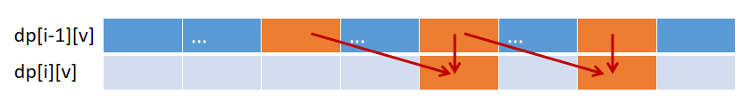

# 动态规划

[[toc]]

## 爬楼梯

::: tip 题目

假设你正在爬楼梯。需要 n 阶你才能到达楼顶。每次你可以爬 1 或 2 个台阶。你有多少种不同的方法可以爬到楼顶呢？

输入： 2  
输出： 2  
解释： 有两种方法可以爬到楼顶。

:::

解法一

每次可以爬 1 或 2 个台阶，到第 n 阶楼梯时要么从

```js
/**
 * @param {number} n
 * @return {number}
 */
const climbStairs = function (n) {
  // 处理递归边界
  if (n === 1) {
    return 1;
  }
  if (n === 2) {
    return 2;
  }
  // 递归计算
  return climbStairs(n - 1) + climbStairs(n - 2);
};
```

解法二

```JS
/**
 * @param {number} n
 * @return {number}
 */
const climbStairs = function(n) {
  // 初始化状态数组
  const f = [];
  // 初始化已知值
  f[1] = 1;
  f[2] = 2;
  // 动态更新每一层楼梯对应的结果
  for (let i = 3; i <= n; i++) {
    f[i] = f[i - 2] + f[i - 1];
  }
  // 返回目标值
  return f[n];
};
```

## 0-1 背包模型

::: tip 题目

有 n 件物品，物品体积用一个名为 w 的数组存起来，物品的价值用一个名为 value 的数组存起来；每件物品的体积用 w[i] 来表示，每件物品的价值用 value[i] 来表示。现在有一个容量为 c 的背包，问你如何选取物品放入背包，才能使得背包内的物品总价值最大？

:::

- 当前背包内物品的总体积 v
- w: [] 每件物品的体积
- value: [] 每件物品的价值

状态转移方程

```js
dp[i][v] = Math.max(dp[i - 1][v], dp[i - 1][v - w[i]] + value[i]);
```

动态规划最主要的思想：

- 选和不选
- 重叠的子问题（overlap sub-problem）

将状态转移方程放到循环中

```js
for (let i = 1; i <= n; i++) {
  for (let v = w[i]; v <= c; v++) {
    dp[i][v] = Math.max(dp[i - 1][v], dp[i - 1][v - w[i]] + value[i]);
  }
}
```

用<span style='color:red'>滚动数组</span>来优化状态转移方程。

因为 value[i]在每一行都是一个固定的值，所以`dp[i][v]`只依赖于上 `dp[i-1]`行的值,而且是小于当前 v 的值。所以可以从后往前进行覆盖。



```js
for (let i = 1; i <= n; i++) {
  for (let v = c; v >= w[i]; v--) {
    dp[v] = Math.max(dp[v], d[v - w[i]] + value[i]);
  }
}
```

最后的实现方式

```js
function knapsack(n, c, w, value) {
  // dp是动态规划的状态保存数组
  const dp = new Array(c + 1).fill(0);
  // res 用来记录所有组合方案中的最大值
  let res = -Infinity;
  for (let i = 1; i <= n; i++) {
    for (let v = c; v >= w[i]; v--) {
      // 写出状态转移方程
      dp[v] = Math.max(dp[v], dp[v - w[i]] + value[i]);
      // 即时更新最大值
      if (dp[v] > res) {
        res = dp[v];
      }
    }
  }
  return res;
}
```

- bilibili [动态规划 (第 1 讲)](https://www.bilibili.com/video/BV18x411V7fm?p=1&share_medium=iphone&share_plat=ios&share_session_id=05AB749C-18D7-4F07-8E80-C37396B69FDD&share_source=WEIXIN&share_tag=s_i&timestamp=1638611926&unique_k=SGWhnyj)

## 最长上升子序列

LeetCode 真题 300。

::: tip 题目

输入: [10,9,2,5,3,7,101,18] 输出: 4 解释: 最长的上升子序列是 [2,3,7,101]，它的长度是 4。

:::

使用动态规划:

```js
/**
 * @param {number[]} nums
 * @return {number}
 */
const lengthOfLIS = function (nums) {
  // 缓存序列的长度
  const len = nums.length;
  // 处理边界条件
  if (!len) {
    return 0;
  }
  // 初始化数组里面每一个索引位的状态值
  const dp = new Array(len).fill(1);
  // 初始化最大上升子序列的长度为1
  let maxLen = 1;
  // 从第2个元素开始，遍历整个数组
  for (let i = 1; i < len; i++) {
    // 每遍历一个新元素，都要“回头看”，看看能不能延长原有的上升子序列
    for (let j = 0; j < i; j++) {
      // 若遇到了一个比当前元素小的值，则意味着遇到了一个可以延长的上升子序列，故更新当前元素索引位对应的状态
      if (nums[j] < nums[i]) {
        dp[i] = Math.max(dp[i], dp[j] + 1);
      }
    }
    // 及时更新上升子序列长度的最大值
    if (dp[i] > maxLen) {
      maxLen = dp[i];
    }
  }
  // 遍历完毕，最后到手的就是最大上升子序列的长度
  return maxLen;
};
```

- 数组的初始值为 1，从第二个数开始选择；
- 每选一个数，都要回头看；
- 每选一个数，只更新数组的第 i 个数。数组的其它值不进行更新；
- 只有`nums[j] < nums[i]`时才更新, 即回头看的数小于当前值时，此时`j`处的最大上升子序列增加 1，就是`i`处的值；
- 最后的 dp 记录的是个数，如果需要求那几个数，可以将数中记录的个数值写成对象。