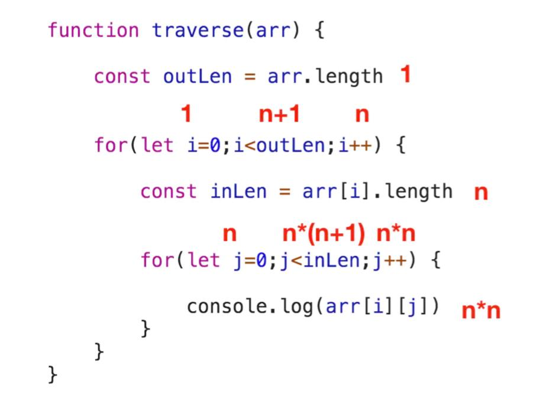

# 时间复杂度和空间复杂度

## 时间复杂度

```
O(n) = logn
```

例子：

```js
function traverse(arr) {
  var outLen = arr.length;

  for (var i = 0; i < outLen; i++) {
    var inLen = arr[i].length;

    for (var j = 0; j < inLen; j++) {
      console.log(arr[i][j]);
    }
  }
}
```



总执行次数 T(n)

```
T(n) = 1 + 1 + (n+1) + n + n + n + n*(n+1) + n*n + n*n = 3n^2 + 5n + 3
```

处理后

```
T(n) = 3n^2 + 5n + 3
O(n) = n^2
```

复杂度：

- 常数：O(1)
- 对数时间：O(logN)
- 线性时间：O(N)
- 线性对数时间：O(NlogN)
- 二次时间：O(N^2)
- 三次时间：O(N^3)
- 指数时间：O(2^N)

## 空间复杂度

空间复杂度是对一个算法在运行过程中临时占用存储空间大小的量度。

```js
function traverse(arr) {
  var len = arr.length;
  for (var i = 0; i < len; i++) {
    console.log(arr[i]);
  }
}
```

空间复杂度就是 O(1)

资料：

- [JavaScript-Algorithms](https://github.com/sisterAn/JavaScript-Algorithms)
