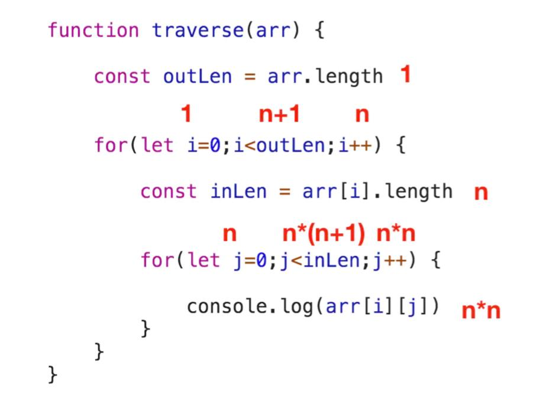

# 数据结构与算法(二)

[[toc]]

## DFS（深度优先搜索）

**深度优先搜索的本质——栈结构**

二叉树的先序遍历正是深度优先搜索思想的递归实现。

```js
// 所有遍历函数的入参都是树的根结点对象
function preorder(root) {
  // 递归边界，root 为空
  if (!root) {
    return;
  }

  // 输出当前遍历的结点值
  console.log('当前遍历的结点值是：', root.val);
  // 递归遍历左子树
  preorder(root.left);
  // 递归遍历右子树
  preorder(root.right);
}
```

## BFS（广度优先搜索）

```js
function BFS(root) {
  const queue = []; // 初始化队列queue
  // 根结点首先入队
  queue.push(root);
  // 队列不为空，说明没有遍历完全
  while (queue.length) {
    const top = queue[0]; // 取出队头元素
    // 访问 top
    console.log(top.val);
    // 如果左子树存在，左子树入队
    if (top.left) {
      queue.push(top.left);
    }
    // 如果右子树存在，右子树入队
    if (top.right) {
      queue.push(top.right);
    }
    queue.shift(); // 访问完毕，队头元素出队
  }
}
```

采用队列来来管理遍历顺序

## 时间复杂度

```
O(n) = logn
```

例子：

```js
function traverse(arr) {
  var outLen = arr.length;

  for (var i = 0; i < outLen; i++) {
    var inLen = arr[i].length;

    for (var j = 0; j < inLen; j++) {
      console.log(arr[i][j]);
    }
  }
}
```



总执行次数 T(n)

```
T(n) = 1 + 1 + (n+1) + n + n + n + n*(n+1) + n*n + n*n = 3n^2 + 5n + 3
```

处理后

```
T(n) = 3n^2 + 5n + 3
O(n) = n^2
```

复杂度：

- 常数：O(1)
- 对数时间：O(logN)
- 线性时间：O(N)
- 线性对数时间：O(NlogN)
- 二次时间：O(N^2)
- 三次时间：O(N^3)
- 指数时间：O(2^N)

## 空间复杂度

空间复杂度是对一个算法在运行过程中临时占用存储空间大小的量度。

```js
function traverse(arr) {
  var len = arr.length;
  for (var i = 0; i < len; i++) {
    console.log(arr[i]);
  }
}
```

空间复杂度就是 O(1)

资料：

- [JavaScript-Algorithms](https://github.com/sisterAn/JavaScript-Algorithms)
