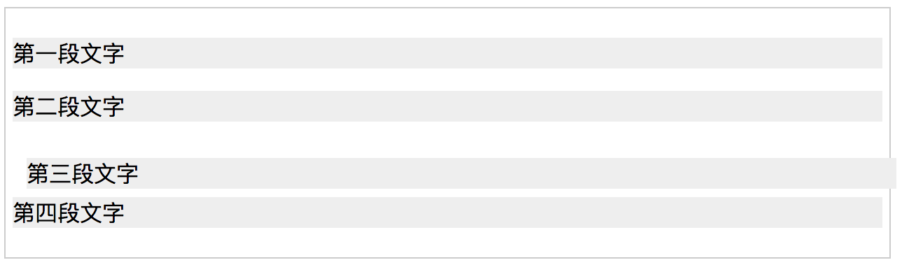
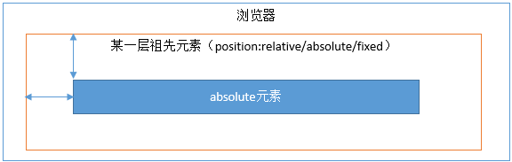

## 目录

[[toc]]

### 如何理解 html 标签语义化

html5 新出的标签，每个标签都有自己语义，什么标签做什么事。让人看的懂，也让机器可以看的懂，利于 SEO。

### css 权重是什么

- 设置节点样式的方式有很多种，不同的方式它们的权重并不相同，当它们给一个节点设置同一个样式时，谁的权重高谁就生效。
- important：无限高
- 行内样式：权重值为 1000
- id 选择器：权重值为 100
- 类、伪类、属性选择器：权重值为 10
- 元素选择器：权重值为 1

### 盒模型有几种，它们区别是什么

- 标准盒模型：设置的宽高只是包括内容区，`content-box`
- IE 盒模型：设置的宽高包含了内边距和边框，`border-box`
- 使用`box-sizing`属性设置：`border-box`：IE 盒模型、`content-box`：标准盒模型。

### 什么是 BFC

块级格式上下文，一句话来说就是让块级元素有块级元素该有的样子，触发`BFC`可以清除浮动、让`margin`不重叠。张鑫旭称"css 世界的结界"，主要的作用是会形成一个封闭空间。

### 如何触发 BFC

- `float`的值不为`none`。
- `overflow`的值不为 auto、scroll 或 hidden。
- `display`的值为 table-cell、table-caption 和 inline-block 中的任何一个。
- `position`的值不为 static 或 releative 中的任何一个。

最佳结界：`overflow`

### 你常用的清除浮动方式是什么

```css
.clear:after, .clear:before {
  content: ' ';
  display: table;
}
.clear:after {
  clear: both;
}
```

### em、rem 的区别

- `em`：如果父级有设置字体大小，1em 就是父级的大小，没有 1em 等于自身默认的字体大小。
- `rem`：相对于`html`标签的字体大小。

### 不使用`border`属性画一条`1px`的线

```html
<div style='height: 1px; background: #666; overflow: hidden;'></div>
<hr size='1'></hr>
```

### 定位的方式有哪几种，它们的区别是什么

- relative：相较于自身定位，设置的位置相对于自己进行位移。不脱离文档流。
- absolute：相较于最近有定位的父节点定位，设置的位置相较于父节点。会脱离文档流，导致父节点高度塌陷。
- fixed：相较于当前窗口进行定位，设置的位置相较于窗口。脱离文档流。

### relative



- 第三个 `<p>` 发生了位置变化，分别向右向下移动了 10px；
- 其他的三个`<p>`位置没有发生变化，第四个都没有下移，这一点也很重要。

**relative 会导致自身位置的相对变化，而不会影响其他元素的位置、大小**。这是 relative 的要点之一。还有第二个要点，就是 relative 产生一个新的定位上下文。

### absolute

- absolute 元素脱离了文档结构。和 relative 不同，其他三个元素的位置重新排列了。只要元素会脱离文档结构，它就会产生破坏性，导致父元素坍塌。（此时你应该能立刻想起来，float 元素也会脱离文档结构。）
- absolute 元素具有“包裹性”。之前`<p>`的宽度是撑满整个屏幕的，而此时`<p>`的宽度刚好是内容的宽度。
- absolute 元素具有“跟随性”。虽然 absolute 元素脱离了文档结构，但是它的位置并没有发生变化，还是老老实实地呆在它原本的位置，因为我们此时没有设置 top、left 的值。
- absolute 元素会悬浮在页面上方，会遮挡住下方的页面内容。

通过给 absolute 元素设置 top、left 值，可自定义其内容，这个都是平时比较常用的了。这里需要注意的是，设置了 top、left 值时，元素是相对于最近的定位上下文来定位的，而不是相对于浏览器定位。

### fixed

其实 fixed 和 absolute 是一样的，唯一的区别在于：absolute 元素是根据最近的定位上下文确定位置，而 fixed 根据 window （或者 iframe）确定位置。

### 定位上下文

- relative 元素的定位永远是相对于元素自身位置的，和其他元素没关系，也不会影响其他元素。
- fixed 元素的定位是相对于 window （或者 iframe）边界的，和其他元素没有关系。但是它具有破坏性，会导致其他元素位置的变化。
- absolute 的定位相对于前两者要复杂许多。如果为 absolute 设置了 top、left，浏览器会根据什么去确定它的纵向和横向的偏移量呢？答案是浏览器会递归查找该元素的所有父元素，如果找到一个设置了`position:relative/absolute/fixed`的元素，就以该元素为基准定位，如果没找到，就以浏览器边界定位。



### 介绍下 flex 布局

主轴方向：水平排列（默认） | 水平反向排列 | 垂直排列 | 垂直反向排列
flex-direction: row | row-reverse | column | column-reverse;

换行：不换行（默认） | 换行 | 反向换行（第一行在最后面）
flex-wrap: nowrap | wrap | wrap-reverse;

flex-direction 属性和 flex-wrap 属性的简写形式，默认值为 row nowrap
flex-flow: `<flex-direction>` || `<flex-wrap>`;

主轴对齐方式：起点对齐（默认） | 终点对齐 | 居中对齐 | 两端对齐 | 分散对齐
justify-content: flex-start | flex-end | center | space-between | space-around;

交叉轴对齐方式：拉伸对齐（默认） | 起点对齐 | 终点对齐 | 居中对齐 | 第一行文字的基线对齐
align-items: stretch | flex-start | flex-end | center | baseline;

多根轴线对齐方式（说的是多根轴线在竖轴上的分布）：拉伸对齐（默认） | 起点对齐 | 终点对齐 | 居中对齐 | 两端对齐 | 分散对齐
align-content: stretch | flex-start | flex-end | center | space-between | space-around;

### 垂直水平居中的实现方式有哪些

父级设置 text-align: center 和 line-height 等同高度。

子节点绝对定位，设置 position: absolute;top: 50%;left: 50%;transform: translate(-50%, -50%);

子节点绝对定位，需要设置宽度和高度。设置 position: absolute;top:0;left:0;right:0;bottom:0;margin:auto;

父级设置 display: table，子节点设置 display:table-cell;text-align:center;vertical-align:middle;

父级设置 display: flex; justify-content:center; align-items:center;

父节点设置 display: grid;，子节点设置：align-self:center;justify-self: center;

> 百分比 transform 会让 IOS 微信闪退。需要避免 table 布局，推荐使用 position 和 margin 的组合。（张鑫旭 css 世界 202 页）

### 左右宽度固定，中间自适应的三栏布局方案有哪些

```html
<div class='parent'>
  <div class='left'></div>
  <div class='center'></div>
  <div class='right'></div>
</div>
```

- 浮动

```css
.parent {overflow: hidden;}
.left {float: left; width: 100px;}
.right: {float: right; width: 100px;}
```

> 兼容性好，简单；脱离文档流；撑开两边，下面也会变形。创建 bfc 解决，如 overflow: hidden;

- 定位 1：

```css
.parent {postion: relative}
.left {position: absolute; left: 0; width: 100px}
.right {position: absolute; right: 0; width: 100px}
.center {position: absolute; left: 100px; right: 100px}
```

- 定位 2

```css
.parent {postion: relative}
.left {position: absolute; left: 0; width: 100px}
.right {position: absolute; right: 0; top: 0; width: 100px}
.center {margin: 0 100px 0 100px};
```

- 表格

```css
.parent {dispaly: table; width: 100%;}
.left {display: table-cell; width: 100px;}
.center {display: table-cell;}
.right {display: table-cell; width: 100px;}
```

- 弹性

```css
.parent {display: flex;}
.left {width: 100px;}
.center {flex: 1;}
.right {width: 100px;}
```

> 移动端很完美；且撑开两边

- 网格

```css
.parent {
  display: grid;
  width: 100%;
  grid-template-rows: 100px;
  grid-template-columns: 100px auto 100px;
}
```

### 重绘和回流

- **重绘**：指的是当页面中的元素不脱离文档流，而简单地进行样式的变化，比如修改颜色、背景等，浏览器重新绘制样式
- **回流**：指的是处于文档流中 DOM 的尺寸大小、位置或者某些属性发生变化时，导致浏览器重新渲染部分或全部文档的情况

相比之下，**回流要比重绘消耗性能开支更大**。另外，一些属性的读取也会引起回流，比如读取某个 DOM 的高度和宽度，或者使用 `getComputedStyle` 方法。在写代码的时候要避免回流和重绘。

### BEM 命名规范

BEM 的意思就模块（Block）、元素（Element）、修饰符（Modifier），使用这种命名方式可以让 CSS 的类名变得有实际意义且能自我解释，具有更高的开发友好性。

```html
<!-- S Search Bar 模块 -->
<div class="search-bar">
  <input class="search-form__input"/>
  <!-- / input 输入框子元素 -->
  <button class="search-form__button"></button>
  <!-- / button 搜索按钮子元素 -->
</div>
<!-- E Search Bar 模块 -->
```

```SCSS
// 以下是 SCSS 代码
.search-bar {
  &__input { ... }
  &__button { ... }
}
```

.block 代表了更高级别的抽象或组件。
.block__element 代表。block 的后代，用于形成一个完整的。block 的整体。
.block--modifier 代表。block 的不同状态或不同版本。一般是外观或行为

### 如何选择图片格式，例如 png, webp

| 图片格式 | 压缩方式 | 透明度 | 动画   | 浏览器兼容         | 适应场景                       |
| :------: | :------: | ------ | ------ | ------------------- | ---------------------- |
| JPEG     | 有损压缩 | 不支持 | 不支持 | 所有                                     | 复杂颜色及形状、尤其是照片                       |
| GIF      | 无损压缩 | 支持   | 支持   | 所有                                     | 简单颜色，动画                                   |
| PNG      | 无损压缩 | 支持   | 不支持 | 所有                                     | 需要透明时                                       |
| APNG     | 无损压缩 | 支持   | 支持   | FirefoxSafariiOS Safari                  | 需要半透明效果的动画                             |
| WebP     | 有损压缩 | 支持   | 支持   | ChromeOperaAndroid ChromeAndroid Browser | 复杂颜色及形状浏览器平台可预知                   |
| SVG      | 无损压缩 | 支持   | 支持   | 所有（IE8以上）                          | 简单图形，需要良好的放缩体验需要动态控制图片特效 |

## 响应式页面开发

### viewport 设置

网页应在 head 标签内添加 viewport meta 标签，以便优化在移动设备上的展示效果，其推荐的设置为：

```html
<meta name="viewport" content="width=device-width; initial-scale=1; maximum-scale=1; minimum-scale=1; user-scalable=no;">
```

### Media Queries

方法 1，使用 link 标签，根据指定特性引入特定的外部样式文件

```html
<link rel="stylesheet" media="(max-width: 640px)" href="max-640px.css">
```

方法 2，直接在 style 标签或 样式文件内使用 @media 规则

```css
@media (max-width: 640px) {
  /*当视窗宽度小于或等于 640px 时，这里的样式将生效*/
}
```

常用的样式断点（参考）

| 断点名称    | 断点描述）                         |
| :--------- | :------------------------------- |
| mobile     | 移动设备断点，视窗宽度 ≤ 768 px      |
| tablet     | 平板电脑设备断点，视窗宽度 ≥ 769 px  |
| desktop    | 桌面电脑断点，视窗宽度 ≥ 1024 px     |
| widescreen | 宽屏电脑断点，视窗宽度 ≥ 1216 px     |
| fullhd     | 高清宽屏电脑断点，视窗宽度 ≥ 1408 px  |

### 如何适配

**1. 使用 rem 适配：**

```js
// set 1rem = viewWidth / 10
function setRemUnit () {
    var rem = docEl.clientWidth / 10
    docEl.style.fontSize = rem + 'px'
}
setRemUnit();
```

在之前的项目中是这样使用的：

```js
let clientWidth = document.body.clientWidth >= 600 ? 600 : document.body.clientWidth;
document.querySelector('html').style.fontSize = (clientWidth / 16) + 'px';
```

有 vs code 中有计算 rem 的插件

::: danger Note

阻塞渲染，和重新计算的问题

缺点：本质上，**用户使用更大的屏幕，是想看到更多的内容，而不是更大的字。**

:::

**2. 使用 vw，vh 布局：**

vh、vw 方案即将视觉视口宽度 window.innerWidth 和视觉视口高度 window.innerHeight 等分为 100 份。

vh 和 vw 方案和 rem 类似也是相当麻烦需要做单位转化，而且 px 转换成 vw 不一定能完全整除，因此有一定的像素差。

不过在工程化的今天，webpack 解析 css 的时候用 postcss-loader 有个 postcss-px-to-viewport 能自动实现 px 到 vw 的转化

```js
{
  loader: 'postcss-loader',
  options: {
    plugins: ()=>[
        require('autoprefixer')({
          browsers: ['last 5 versions']
        }),
        require('postcss-px-to-viewport')({
          viewportWidth: 375, //视口宽度（数字)
          viewportHeight: 1334, //视口高度（数字）
          unitPrecision: 3, //设置的保留小数位数（数字）
          viewportUnit: 'vw', //设置要转换的单位（字符串）
          selectorBlackList: ['.ignore', '.hairlines'], //不需要进行转换的类名（数组）
              minPixelValue: 1, //设置要替换的最小像素值（数字）
              mediaQuery: false//允许在媒体查询中转换px（true/false）
        })
    ]
  }
}
```

**3.vw 搭配 rem，寻找最优解**

```css
// rem 单位换算：定为 75px 只是方便运算，750px-75px、640-64px、1080px-108px，如此类推
$vw_fontsize: 75; // iPhone 6尺寸的根元素大小基准值
@function rem($px) {
     @return ($px / $vw_fontsize ) * 1rem;
}
// 根元素大小使用 vw 单位
$vw_design: 750;
html {
    font-size: ($vw_fontsize / ($vw_design / 2)) * 100vw;
    // 同时，通过Media Queries 限制根元素最大最小值
    @media screen and (max-width: 320px) {
        font-size: 64px;
    }
    @media screen and (min-width: 540px) {
        font-size: 108px;
    }
}
// body 也增加最大最小宽度限制，避免默认100%宽度的 block 元素跟随 body 而过大过小
body {
    max-width: 540px;
    min-width: 320px;
}
```

### 设备像素比

设备像素比 device pixel ratio 简称 dpr，即物理像素和设备独立像素的比值。

物理像素也叫设备像素，设备独立像素也叫逻辑分辨率。一般说的 2k 屏都是物理像素。苹果 6 的物理分辨率为 750x1334，而逻辑分辨率为 375x667。

在 web 中，浏览器为我们提供了`window.devicePixelRatio`来帮助我们获取 dpr。在 css 中，可以使用媒体查询`min-device-pixel-ratio`，区分 dpr。

### 1 像素线边框问题

往往说的 1 像素边框问题就是如何实现 1 物理像素的问题。

解决方案 1：**transform: scaleY() 方案**

```css
div {
    height:1px;
    background:#000;
    -webkit-transform: scaleY(0.5);
    -webkit-transform-origin:0 0;
    overflow: hidden;
}
```

css 根据设备像素比媒体查询后的解决方案

```css
/* 2倍屏 */
@media only screen and (-webkit-min-device-pixel-ratio: 2.0) {
    .border-bottom::after {
        -webkit-transform: scaleY(0.5);
        transform: scaleY(0.5);
    }
}

/* 3倍屏 */
@media only screen and (-webkit-min-device-pixel-ratio: 3.0) {
    .border-bottom::after {
        -webkit-transform: scaleY(0.33);
        transform: scaleY(0.33);
    }
}
```

也可以采用下面的形式的封装：

```css
.mod_grid {
    position: relative;
    &::after {
        // 实现1物理像素的下边框线
        content: '';
        position: absolute;
        z-index: 1;
        pointer-events: none;
        background-color: #ddd;
        height: 1px;
        left: 0;
        right: 0;
        top: 0;
        @media only screen and (-webkit-min-device-pixel-ratio: 2) {
            -webkit-transform: scaleY(0.5);
            -webkit-transform-origin: 50% 0%;
        }
    }
    ...
}
```

移动端适配流程

1. 在 head 设置 width=device-width 的 viewport

2. 在 css 中使用 px

3. 在适当的场景使用 flex 布局，或者配合 vw 进行自适应

4. 在跨设备类型的时候（pc <-> 手机 <-> 平板）使用媒体查询

5. 在跨设备类型如果交互差异太大的情况，考虑分开项目开发
