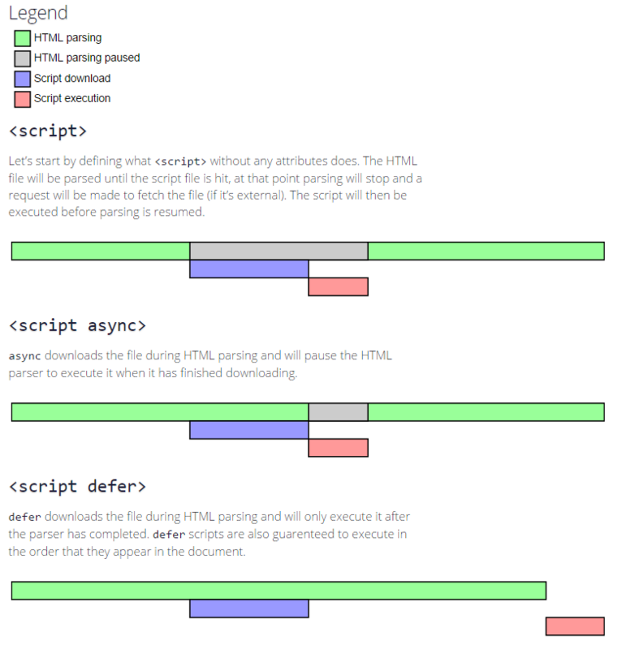

## 目录

[[toc]]

## JavaScript 基础

### JavaScript 的变量有哪些类型

- 分为两种：基础类型和引用类型。基础类型目前有六种，
分别是`boolean`、`null`、`undefined`、`number`、`string`、`symbol`、`bigInt`
- 除了以上的基础类型之外，其他就是引用类型了，有`Array`、`Object`、`Function`。

### typeof 和 instanceof 的区别

- typeof 对于基础类型除了 null 以外都可以显示正确的类型，对于数组和对象都会显示 object，对于函数会显示 function。
- instanceof 主要是用来判断引用类型，它的原理是根据原型链来查找。

::: tip
函数也是一个对象，有 prototype 属性；函数实例的 instanceof 可以是构造函数本身；也可以是 Object 对象；
:::

### 何时使用 === 何时使用 ==

首先得明白两者的区别，`==`会先试图类型转换，然后再比较，而`===`不会类型转换，直接比较。如下例子：

```javascript
1 == '1' // true
1 === '1' // false
0 == false // true
0 === false // false
null == undefined // true
null === undefined // false
```

根据 jQuery 源码中的写法，只推荐在一个地方用`==`，其他地方都必须用`===`。这个用`==`的地方就是：

```javascript
if (obj.a == null) {}
// 这里相当于 obj.a === null || obj.a === undefined ，简写形式
```

编程是需要绝对严谨的态度，我们只在这一个地方让它进行类型转换，来简化我们的写法，因为这个场景非常简单和固定。而其他场景下，我们都必须使用`===`，除非有特殊的业务需要。

### 是否 === 就完全靠谱

也是不一定的，例如`0 === -0`就为`true`，`NaN === NaN`为`false`，判断两个变量是否完全相等可以使用`ES6`新增的`API`，`Object.is(0, -0)`，`Object.is(NaN, NaN)`就可以准确区分。

### 在类型转换中哪些值会被转为 true

除了`undefined`、`null`、`false`、`NaN`、`''`、`0`、`-0`以外的值都会被转为`true`，包括所有引用类型，即使是空的。

### toString() 和 valueOf 的区别

- null 和 undefined 没有以上两个方法。
- toString：值类型时返回自身的字符串形式；当是引用类型时，无论是一维或多维数组，将他们拍平成一个字符串，里面的 null 和 undefined 转为空字符串''，对象转为 [object Object]，函数的原样返回字符串形式。
- valueOf 无论是值类型还是引用类型，大部分情况下都是原样返回，当是 Date 类型时，返回时间戳。
- 在进行字符串强转的时候，toString 会优先于 valueOf；在进行数值运算时，valueOf 会优先于 toString。
- 当执行 toString 的变量是一个整数类型时，支持传参，表示需要转为多少进制的字符串。

### JS 中有哪些内置函数

`Object` `Array` `Boolean` `Number` `String` `Function` `Date` `RegExp` `Error`

对于这种问题，回复时能把基本常用的回答上来就可以，没必要背书把所有的都写上。

### 创建对象有几种方法

- 字面量，{}；
- 构造函数，构造函数的实例是一个对象；
- Object.create；

### 有没有更好的判断变量类型的方法

可以使用`Object.prototype.toString.call(var)`，可以更加准确的判断某个变量的类型。

### 如何判断一个变量是否是数组

```js
arr instanceof Array
Array.prototype.isPrototypeOf(arr)
Array.isArray(arr)
Object.prototype.toString.call(arr) === '[object Array]'
arr.constructor === Array
```

### Array.prototype 的类型是什么吗

很多人都不知道，其实 Array.prototype 是一个数组，只不过 length 为 0

### 类数组转为数组的方式有哪些

```js
[].slice.call(arguments)
Array.from(arguments)
[...arguments]
```

### 将多维数组扁平化

```js
function flatten(arr) {
  return [].concat(...arr.map(v => {
    return Array.isArray(v) ? flatten(v) : v;
  }))
}

function flatten(arr) {
  return arr.reduce((pre, cur) => {
    return pre.concat(Array.isArray(cur) ? flatten(cur) : cur);
  }, [])
}

function flatten(arr) {
  return arr.flat(Infinity);
}

function flatten(arr) {  // 纯数字
  return arr.toString().split(',').map(Number);
}

function flatten(arr) {
  const ret = [];
  while (arr.length) {
    const item = arr.shift();
    if (Array.isArray(item)) {
      arr.unshift(...item);
    } else {
      ret.push(item);
    }
  }
  return ret;
}
```

**flat 方法：**

- 指定要提取嵌套数组的结构深度，默认值为 1。一般会这样写：arr.flat(Infinity)。
- `flat()` 方法会移除数组中的空项；
- 使用 `reduce` 与 `concat`等

用递归的话，代码会比较复杂。还可以用以下方法来解决这个问题：

**利用 Array.prototype.toString() 方法：**

```js
var list = [1,[2,[3]],4,[5]];
console.log(list.toString()); //1,2,3,4,5
```

原理：toString 方法返回一个字符串，该字符串由数组中的每个元素的 toString() 返回值经调用 join() 方法连接（由逗号隔开）组成。

**利用 Array.prototype.join() 方法：**

```js
var list = [1,[2,[3]],4,[5]];
console.log(list.join()); //1,2,3,4,5
```

原理：join 方法会让所有的数组元素转换成字符串，再用一个分隔符将这些字符串连接起来。如果元素是 undefined 或者 null， 则会转化成空字符串。

### 数组去重

```js
function unique(arr) {
  return [...new Set(arr)];
}

function unique(arr) {
  return arr.filter((v, i, a) => {
    return a.indexOf(v) === i;
  })
}

function unique(arr) {
  const tmp = new Map();
  return arr.filter(v => {
    return !tmp.has(v) && tmp.set(v);
  })
}
```

### JS 判断数组中是否包含某个值

- array.indexOf
- array.includes()
- array.find()
- array.findeIndex()

### 字符串的 test、match、search 之间的区别

```js
// test 是检测字符串是否匹配某个正则，返回布尔值
/[a-z]/.test(1);  // false

// match 是返回检测字符匹配正则的数组结果集合，没有返回 null
'1AbC2d'.match(/[a-z]/ig);  // ['A', 'b', 'C', 'd']

// search 是返回正则匹配到的下标，没有返回-1
'1AbC2d'.search(/[a-z]/);  // 2
```

### 字符串的 slice、substring、substr 之间的区别

```js
//  slice 是返回字符串开始至结束下标减去开始下标个数的新字符串，下标是负数为倒数；
'abcdefg'.slice(2,3);  // c  // 3 - 2
'abcdefg'.slice(3,2);  // ''  // 2 - 3
'abcdefg'.slice(-2,-1);  // f  // -1 - -2

// substring 和 slice 正常截取字符串时相同，负数为0，且下标值小的为开始下标；
'abcdefg'.substring(2,3);  //c  // 3 - 2
'abcdefg'.substring(3,2);  // c  // 3 - 2
'abcdefg'.substring(3,-3);  // abc  // 3 - 0

// substr 返回开始下标开始加第二个参数(不能为负数)个数的新字符串。
'abcdefg'.substr(2, 3);  // cde
'abcdefg'.substr(3, 2);  // de
'abcdefg'.substr(-3, 2); // ef

```

### Number('123') 和 new Number('123') 有什么区别

- `Number('123')`是一个转换函数，会尝试把参数转为整数类型；而`new Number('123')`则不同，这是一个构造函数，它的结果是实例化出来一个对象。
- 同样的情况也适用用`String`和`new String`；`Boolean`和`new Boolean`的情况。

```js
typeof Number('123') // number
typeof new Number('123') // object
```

### JS 精度丢失问题

浮点数的精度丢失不仅仅是js的问题， java 也会出现精度丢失的问题，主要是因为数值在内存是由二进制存储的，而某些值在转换成二进制的时候会出现无限循环，由于位数限制，无限循环的值就会采用“四舍五入法”截取，成为一个计算机内部很接近数字，即使很接近，但是误差已经出现了。

```js
0.1 + 0.2  = 0.30000000000000004
// 0.1 转成二进制会无限循环
// "0.000110011001100110011001100110011001100110011001100..."
```

那么如何避免这问题呢？解决办法：可在操作前，放大一定的倍数，然后再除以相同的倍数

```js
(0.1 *100 + 0.2*100) / 100 = 0.3
```

> js 的 number 采用 64位双精度存储 JS 中能精准表示的最大整数是 Math.pow(2, 53)

推荐一个开源工具 [[number-precision](https://github.com/nefe/number-precision)]

### toFixed 可以做到四舍五入吗

`toFixed` 对于四舍六入没问题，但对于尾数是 `5` 的处理就非常诡异

```js
// 使用 Math.round 可以四舍五入的特性，把数组放大一定的倍数处理
function round(number, precision) {
    return Math.round(+number + 'e' + precision) / Math.pow(10, precision);
}
```

原理是，`Math.round` 是可以做到四舍五入的，但是仅限于正整数，那么我们可以放大至保留一位小数，计算完成后再缩小倍数。

### js中不同进制怎么转换

10 进制转其他进制：`Number(val).toString([2,8,10,16])`

其他进制转成10进制：`Number.parseInt("1101110",[2,8,10,16])`

其他进制互转：先将其他进制转成 10 进制，在把 10 进制转成其他进制

### 对js处理二进制有了解吗

ArrayBuffer: 用来表示通用的、固定长度的原始二进制数据缓冲区，作为内存区域，可以存放多种类型的数据，它不能直接读写，只能通过视图来读写。

同一段内存，不同数据有不同的解读方式，这就叫做“视图”（view），视图的作用是以指定格式解读二进制数据。目前有两种视图，一种是 `TypedArray` 视图，另一种是 `DataView` 视图，两者的区别主要是字节序，前者的数组成员都是同一个数据类型，后者的数组成员可以是不同的数据类型。

Blob: 也是存放二进制的容器，通过 `FileReader` 进行转换。

之前有做过简单的总结，大家可以看看：[nodejs 二进制与Buffer](https://juejin.im/post/5d188e1fe51d454fd8057bc9)

毕竟对这块应用的比较少，推荐一篇文章给大家 [二进制数组](http://javascript.ruanyifeng.com/stdlib/arraybuffer.html)


## DOM API

### DOM 事件的级别

- DOM0 element.onclick = function(){};
- DOM2 element.addEventListener('click',function(){},false);
- DOM3 element.addEventListener('keyup',function(){},false);

有 DOM1 级标准，但没有事件；DOM3 只是增加了一些事件类型。

### 什么是事件流 / 模型

当某一个事件被触发时，分为三个阶段：

1. 事件通过捕获从 window => document => body => 目标元素
2. 事件到达注册的目标上
3. 目标元素通过冒泡返回到 window，沿途触发相同类型的事件

### JS 事件的几种绑定方式

- 在 dom 元素中直接绑定，`<div class="an" onclick="aa()">aaaa</div>`
- js 中绑定 document.getElementById("demo").οnclick=function(){}
- 添加监听事件 document.addEventListener('name',()=>{})

### Event 对象常见的应用

- event.preventDefault() 阻止默认事件
- event.stopPropagation() 阻止冒泡
- event.stopImmediatePropagation() 事件的优先级
- event.currentTaget 当前绑定事件，就是那个父级元素
- event.target 当前被点击的元素

后面两种是事件委托。

### 自定义事件 ---

```js
var eve = new Event('custome');
ev.addEventListener('custome',function(){
  console.log(custome)
})
ev.dispathEvent(eve)
```

addEventListener 最后一个参数：
true 为捕获；
false 为冒泡。

### DOM 节点的 Attribute 和 property 有何区别

- property 只是一个 JS 属性的修改。prototype 不是一个 api，只是一种操作形式；不会添加本身没有的属性。
- attr 是对 html 标签属性的修改。可以添加新的属性；

### DOM 树操作（api）

- 查找元素：querySelector、querySelectorAll、getElementById、getElementsByTagName、getElementsByClassName
- parentElement、childNodes、firstChild、lastChild
- createElement、removeChild、appendChild、insertBefore
- getElementById、getElementsByName、getElementsByTagName、getElementsByClassName，这几个 API 的性能高于 querySelector。
- getElementsByName、getElementsByTagName、getElementsByClassName 获取的集合并非数组，而是一个能够动态更新的集合。
- 虚拟 DOM 中最后还是通过以上 api 创建、和更新了 DOM。

### document load 和 ready 的区别

```js
window.addEventListener('load', function () {
    // 页面的全部资源加载完才会执行，包括图片、视频等
})
document.addEventListener('DOMContentLoaded', function () {
    // DOM 渲染完即可执行，此时图片、视频还可能没有加载完
})
```

原生中没有 ready 这 api，jQuery 中有 ready

## BOM

### 浏览器或元素的一些距离属性

- document.documentElement.clientHeight：当前窗口内容区 + 内边距的高度
- window.innerHeight: 当前窗口内容区 + 内边距 + 边框 + 滚动条高度
- window.outerHeight：整个浏览器的高度（包括工具栏）
- clientHeight: 当前元素内容区 + 内边距的高度
- clientTop: 当前元素上边框的宽度
- offsetHeight: 当前元素内容区 + 内边距 + 边框 + 滚动条的高度
- offsetTop: 当前元素的边框距离父元素上外边距的距离
- scrollHeight: 当前内部可以滚动区域的高度，如果不能滚动则为自己内容区 + 内边距的高度
- scrollTop: 当前元素滚动离顶部的距离

### 怎么确定当前浏览器的类型

通过`navigator.userAgent`获取浏览器信息，根据里面的关键字来确定浏览器类型。microMessenger、dingtalk、alipay、qq、iPhone 都可以获取判断。

## 原型和面向对象

### 描述 new 一个对象的过程

```javascript
function Foo(name) {
    this.name = name
    this.type = 'foo'
}
var foo = new Foo('beijing')
```

- 创建一个新对象，继承 Foo.prototype
- `this` 指向这个新对象
- 执行代码，即对 `this` 赋值
- 返回 `this`

```js
var newFunc = function (func) {
    var o = Object.create(func.prototype);
    var k = func.call(o);   // 执行func  *****
    if (typeof k === 'object') {
      return k;
    } else {
      return o;
    }
};

var p = {name: 'p'};
var o4 = Object.create(p);
```

### 如何实现继承

**1. 借助构造函数实现继承：**

```js
function Parent1 () {
  this.name = 'parent1';
}
function Child1 () {
  Parent1.call(this);
  this.type = 'child1';
}
console.log(new Child1(), new Child1().say());
```

::: danger Note
缺点：Parent1 原型链上的东西没有被继承，只实现了部分继承
:::

**2. 借助原型链实现继承：**

```js
function Parent2 () {
  this.name = 'parent2';
  this.play = [1, 2, 3];
}
function Child2 () {
  this.type = 'child2';
}
Child2.prototype = new Parent2();
var s1 = new Child2();
var s2 = new Child2();
console.log(s1.play, s2.play);
s1.play.push(4);
```

::: danger Note
缺点：原型链较长。如果实例化多个对象，修改一个中的属性，另一个也会变化。
:::

**3. 组合方式：**

```js
function Parent3 () {
  this.name = 'parent3';
  this.play = [1, 2, 3];
}
function Child3 () {
  Parent3.call(this); // 执行1次
  this.type = 'child3';
}
Child3.prototype = new Parent3(); // 执行2次
var s3 = new Child3();
var s4 = new Child3();
s3.play.push(4);
console.log(s3.play, s4.play);
```

::: danger Note
缺点：原型链较长，Parent3 执行了两次。`Parent3.call(this)`、`new Parent3()`
:::

**4. 组合继承的优化 1：**

```js
function Parent4 () {
  this.name = 'parent4';
  this.play = [1, 2, 3];
}
function Child4 () {
  Parent4.call(this);
  this.type = 'child4';
}
Child4.prototype = Parent4.prototype;
```

**5. 组合继承的优化 2：**

```js
function Parent5 () {
  this.name = 'parent5';
  this.play = [1, 2, 3];
}
function Child5 () {
  Parent5.call(this);
  this.type = 'child5';
}
Child5.prototype = Object.create(Parent5.prototype);
```

推荐使用 5。

**6. Class 继承：**

```js
class Parent {
  constructor(value) {
    this.val = value
  }
  getValue() {
    console.log(this.val)
  }
}
class Child extends Parent {
  constructor(value) {
    super(value)
  }
}
let child = new Child(1)
child.getValue() // 1
child instanceof Parent // true
```

`class` 实现继承的核心在于使用 `extends` 表明继承自哪个父类，并且在子类构造函数中必须调用 `super`，因为这段代码可以看成 `Parent.call(this, value)`。

## ES6 有关

### 为什么要使用模块化

- 解决命名冲突
- 提供复用性
- 提高代码可维护性

### 都有哪几种方式可以实现模块化，各有什么特点

**立即执行函数：**

在早期，使用立即执行函数实现模块化是常见的手段，通过函数作用域解决了命名冲突、污染全局作用域的问题

```js
(function(globalVariable){
   globalVariable.test = function() {}
   // ... 声明各种变量、函数都不会污染全局作用域
})(globalVariable)
```

**AMD 和 CMD：**

目前这两种实现方式已经很少见到，不必要关注。

```js
// AMD
define(['./a', './b'], function(a, b) {
  // 加载模块完毕可以使用
  a.do()
  b.do()
})
// CMD
define(function(require, exports, module) {
  // 加载模块
  // 可以把 require 写在函数体的任意地方实现延迟加载
  var a = require('./a')
  a.doSomething()
})
```

**CommonJS：**

CommonJS 最早是 Node 在使用，目前也仍然广泛使用，比如在 Webpack 中你就能见到它，当然目前在 Node 中的模块管理已经和 CommonJS 有一些区别了。

```js
// a.js
module.exports = {
    a: 1
}
// or
exports.a = 1

// b.js
var module = require('./a.js')
module.a // -> log 1
```

require 函数

```js
var module = require('./a.js')
module.a
// 这里其实就是包装了一层立即执行函数，这样就不会污染全局变量了，
// 重要的是 module 这里，module 是 Node 独有的一个变量
module.exports = {
    a: 1
}
// module 基本实现
var module = {
  id: 'xxxx', // 我总得知道怎么去找到他吧
  exports: {} // exports 就是个空对象
}
// 这个是为什么 exports 和 module.exports 用法相似的原因
var exports = module.exports
var load = function (module) {
    // 导出的东西
    var a = 1
    module.exports = a
    return module.exports
};
// 然后当我 require 的时候去找到独特的
// id，然后将要使用的东西用立即执行函数包装下，over
```

另外虽然 exports 和 module.exports 用法相似，但是不能对 exports 直接赋值。因为 var exports = module.exports 这句代码表明了 exports 和 module.exports 享有相同地址，通过改变对象的属性值会对两者都起效，但是如果直接对 exports 赋值就会导致两者不再指向同一个内存地址，修改并不会对 module.exports 起效。

**ES Module：**

自 ES6 起，引入了一套新的 ES6 Module 规范，在语言标准的层面上实现了模块功能，而且实现得相当简单，有望成为浏览器和服务器通用的模块解决方案。但目前浏览器对 ES6 Module 兼容还不太好，我们平时在 Webpack 中使用的 export 和 import，会经过 Babel 转换为 CommonJS 规范。与 CommonJS 有以下几个区别：

1. CommonJS 模块输出的是一个值的拷贝，ES6 模块输出的是值的引用。
2. CommonJS 模块是运行时加载，ES6 模块是编译时输出接口。
3. CommonJs 是单个值导出，ES6 Module 可以导出多个
4. CommonJs 是动态语法可以写在判断里，ES6 Module 静态语法只能写在顶层
5. CommonJs 的 this 是当前模块，ES6 Module 的 this 是 undefined

```js
// 引入模块 API
import XXX from './a.js'
import { XXX } from './a.js'
// 导出模块 API
export function a() {}
export default function() {}
```

> 1.CmmonJS 在导出时可能是值的引用，不是拷贝。有待进一步确定。
>
> 2.CmmonJS require 的时候才去执行，而 ES Module 在 import 时会去构建依赖树。

### Proxy 可以实现什么功能

```js
let p = new Proxy(target, handler)
```

target 代表需要添加代理的对象，handler 用来自定义对象中的操作，比如可以用来自定义 set 或者 get 函数。

Vue3.0 使用 Proxy 替换原本的 API 原因在于 Proxy 无需一层层递归为每个属性添加代理，一次即可完成以上操作，性能上更好，对数组也不用单独处理，Proxy 可以完美监听到任何方式的数据改变，唯一缺陷可能就是浏览器的兼容性不好了。

## JavaScript 的执行机制

### 说一下对变量提升的理解

函数执行时会先创建当前的上下文环境，其中这两点会产生“变量提升”的效果

- 变量定义
- 函数声明

### 谈谈对 this 的理解

this 表示为当前的函数调用方，在运行时才能决定。如谁调用了某个方法，谁就是这个方法执行时的 this。

### 说明 this 几种不同的使用场景

- 作为构造函数执行
- 作为对象属性执行
- 作为普通函数执行
- call apply bind

### 改变当前调用 this 的方式

- call：会立即执行调用 call 方法的函数，不过是以第一个参数为 this 的情况下调用，方法内可以传递不等的参数，作为调用 call 方法的参数。
- apply：运行方式和 call 是一致的，只是接受的参数不同，不能是不定参数，得是一个数组。
- bind：会改变当前的 this，接受不定参数，不过不会马上执行调用 bind 方法的函数，而是返回一个函数作为结果，执行后才是调用函数的结果。

### 谈谈对闭包的理解


## 页面循环系统

### 函数防抖和节流的区别

函数防抖指一定时间内没有再次触发函数，就执行该函数，否则重新计时；节流是规定某个时间内只能执行一次函数。

**防抖的应用场景：**

- 搜索框输入查询，如果用户一直在输入中，没有必要不停地调用去请求服务端接口，等用户停止输入的时候，再调用，设置一个合适的时间间隔，有效减轻服务端压力。
- 表单验证
- 按钮提交事件。
- 浏览器窗口缩放，resize 事件（如窗口停止改变大小之后重新计算布局）等。

```js
let input1 = document.getElementById('inputId')
let timeoutId = null;
input1.addEventListener('keyup', function() {
  if (timeoutId) {
    clearTimeout(timeoutId);
  }
  timeoutId = setTimeout(() => {
    // 执行操作
    timeoutId = null
  }, 500)
})
```

**节流的应用场景：**

- 按钮点击事件
- 拖拽事件
- onScoll
- 计算鼠标移动的距离 (mousemove)

```js
function throttle(fn, deley = 100) {
  let timeoutId = null;
  return function() {
    if (timeoutId) {
      return;
    }
    timeoutId = setTimeout(() => {
      fn.apply(this, arguments);
      timeoutId = null;
    }, deley)
  }
}
dev.addEventListener('drag', throttle(function() {
  // 执行事件
}))
```

不管是防抖还是节流，上面方法都有个问题，就是延时执行，有些场景下需要的不是延时，比如对于提交数据，需要的是防连击，不重复提交数据。对上面代码修改如下：

```js
function throttle(fn, deley = 100) {
  let timeoutId = null;
  return function() {
    if (timeoutId) {
      return;
    }
    fn.apply(this, arguments);
    timeoutId = setTimeout(() => {
      timeoutId = null;
    }, deley)
  }
}
dev.addEventListener('click', throttle(function() {
  // 执行事件
}))
```

### 浏览器的 Event Loop

3 个异步队列是:

- Tasks (in `setTimeout`)
- Animation callbacks (in `requestAnimationFrame`)
- Microtasks (in `Promise.then`)

他们的执行特点是：

- Tasks 只执行一个。执行完了就进入主进程，主进程可能决定进入其他两个异步队列，也可能自己执行到空了再回来。 补充：对于“只执行一个”的理解，可以考虑设置 2 个相同时间的 `timeout`，两个并不会一起执行，而依然是分批的。
- Animation callbacks 执行队列里的全部任务，但如果任务本身又新增 Animation callback 就不会当场执行了，因为那是下一个循环补充：同 Tasks，可以考虑连续调用两句 `requestAnimationFrame`，它们会在同一次事件循环内执行，有别于 Tasks
- Microtasks 直接执行到空队列才继续。因此如果任务本身又新增 Microtasks，也会一直执行下去。所以上面的例子才会产生阻塞。 补充：因为是当次执行，因此如果既设置了 `setTimeout(0)` 又设置了 `Promise.then()`，优先执行 Microtasks。

> 连接：[浏览器的 Event Loop](https://mp.weixin.qq.com/s/N5G3RKTkEG4CMtOwBWkm3g)

## 浏览器渲染

### URL 输入到渲染的过程

1. 域名解析，找到服务地址
2. 构建 TCP 连接，若有 https，则多一层 TLS 握手，
3. 特殊响应码处理 301 302
4. 解析文档
5. 构建 dom 树和 csscom
6. 生成渲染树：从DOM树的根节点开始遍历每个可见节点，对于每个可见的节点，找到CSSOM树中对应的规则，并应用它们，根据每个可见节点以及其对应的样式，组合生成渲染树
7. Layout（回流）：根据生成的渲染树，进行回流（Layout），得到节点的集合信息
8. Painting（重绘）：根据渲染树及其回流得到的集合信息，得到节点的绝对像素。
9. 绘制，在页面上展示，这一步还涉及到绘制层级、GPU相关的知识点
10. 加载js脚本，加载完成解析js脚本

### 触发回流的场景

- 添加或删除可见的DOM元素
- 元素的位置发生变化
- 元素的尺寸发生变化（包括外边距、内边框、边框大小、高度和宽度等）
- 内容发生变化，比如文本变化或图片被另一个不同尺寸的图片所替代。
- 页面一开始渲染的时候（这肯定避免不了）
- 浏览器的窗口尺寸变化（因为回流是根据视口的大小来计算元素的位置和大小的）
- 获取位置信息，因为需要回流计算最新的值

**获取位置信息相关属性**
- offsetTop offsetLeft offsetWidth offsetHeight 相对于父级容器的偏移量
- scrollTop scrollLeft scrollWidth scrollHeight 相对于父级容器滚动上去的距离
- clientTop clientLeft clientWidth clientHeight 元素边框的厚度
- getComputedStyle()
- getBoundingClientRect

### 回流的优化

对树的局部甚至全局重新生成是非常耗性能的，所以要避免频繁触发回流

- 现代浏览器已经帮我们做了优化，采用队列存储多次的回流操作，然后批量执行，但获取布局信息例外，因为要获取到实时的数值，浏览器就必须要清空队列，立即执行回流。
- 编码上，避免连续多次修改，可通过合并修改，一次触发
- 对于大量不同的 dom 修改，可以先将其脱离文档流，比如使用绝对定位，或者 display:none ，在文档流外修改完成后再放回文档里中
- 通过节流和防抖控制触发频率
- css3 硬件加速，transform、opacity、filters，开启后，会新建渲染层

### 开启GPU加速的方法

开启后，会将 dom 元素提升为独立的渲染层，它的变化不会再影响文档流中的布局。

- transform: translateZ(0)
- opacity
- filters
- Will-change

### CSS加载问题

- css加载不会阻塞DOM树的解析;
- css加载会阻塞DOM树的渲染；
- css加载会阻塞后面js语句的执行

### 介绍下资源预加载 prefetch/preload async/defer

**prefetch：** 其利用浏览器空闲时间来下载或预取用户在不久的将来可能访问的文档。

```html
<link href="/js/xx.js" rel="prefetch">
```

**preload：** 可以指明哪些资源是在页面加载完成后即刻需要的，浏览器在主渲染机制介入前就进行预加载，这一机制使得资源可以更早的得到加载并可用，且更不易阻塞页面的初步渲染，进而提升性能。

```html
<link href="/js/xxx.js" rel="preload" as="script"> 
```

**async：** 加载脚本和渲染后续文档元素并行进行，脚本加载完成后，暂停html解析，立即解析js脚本

**defer：** 加载脚本和渲染后续文档元素并行进行，但脚本的执行会等到 html 解析完成后执行



## 通信类

### 如何创建一个 Ajax

```js
var xhr = XMLHttpRequest
  ? new XMLHttpRequest()
  : new ActiveXObject('Microsoft.XMLHTTP');
xhr.onreadystatechange = function(){
  // 通信成功时，状态值为4
  if (xhr.readyState === 4){
    if (xhr.status === 200||304||206){
      console.log(xhr.responseText);
    } else {
      console.error(xhr.statusText);
    }
  }};
xhr.onerror = function (e) {
  console.error(xhr.statusText);
};
xhr.open('GET', '/endpoint', true);
xhr.send(null);
```

### 你知道的解决跨域的方式有几种

**JSONP：**

利用 script 标签不受同源策略限制。

```html
<script src="http://www.abc.com/?data=name&callback=jsonp" charset="utf-8"></script>
<script type="text/javascript">
    jsonp({
        data: {
        },
    });
</script>
```

**WebSocket：**

```js
var ws = new WebSocket('wss://echo.websocket.org');
ws.onopen = function (evt) {
  console.log('Connection open ...');
  ws.send('Hello WebSockets!');
};

// 接收
ws.onmessage = function (evt) {
  console.log('Received Message: ', evt.data);
  ws.close();
};
ws.onclose = function (evt) {
  console.log('Connection closed.');
};
```

**CORS：**

新出的通信标准，支持跨域的 Ajax

CORS 预请求
在跨域时允许的方法只有 GET、POST、HEAD；
允许的 Content-Type 也是有限制的，只允许
text-plain：
multipart/form-data:
application/x-www-form-urlencoded:
其他限制：请求头的限制
对于跨域请求的限制，在跨域时需要做预请求，options
Access-Control-Expose-Headers 可以自定义头
Access-Control-Request-Method 自定义方法
Access-Control-Max-Age 设置时间后，在该时间段里不需要再发请求验证了
其实 Response Hearders 中设计的一系列属性都是给浏览器解析请求的配置项，告诉浏览器去如何解析。

**fetch：**

```js
fetch('/some/url/', {
  method: 'get',
}).then(function (response) {

}).catch(function (err) {
  // 出错了，等价于 then 的第二个参数，但这样更好用更直观
});
```

### document.domain

该方式只能用于**二级域名相同**的情况下，比如 `a.test.com` 和 `b.test.com` 适用于该方式。

只需要给页面添加 `document.domain = 'test.com'` 表示二级域名都相同就可以实现跨域

### cookie 和 session 分别是什么

- cookie 是服务器发送到用户浏览器并保存在本地的一小块数据，它会在浏览器发起请求时被携带并发送到服务器，它通常是告知服务端两个请求是否来自同一浏览器，保持用户的登录状态。
- session 代表着服务器在和客户端一次会话的过程，存储着用户会话所需的属性及配置信息，当用户在不同页面之间跳转时，使整个用户会话一直存在。

### cookie 和 session 有什么不同

- 作用范围不同：cookie 存储在客户端，session 保存在服务器端。
- 存取的方式不同：cookie 只能保存 ASCⅡ，session 可以存取任意数据类型。
- 有效期不同：cookie 可设置长时间保持，session 一般失效时间较短，或客户端关闭就会失效。
- 存储大小不同：单个 cookie 保存的数据不能超过 4k，session 可存储数据远高于 cookie。

### cookie 和 session

浏览器发起第一次请求后服务端会返回一个 sessionID 存储到 cookie 中，当再次发起请求时服务端根据携带的 cookie 里的 sessionID 来查找对应的 session 信息，没有找到就说明没登录或登录失效，找到说明已经登录，可以进行之后的操作。

### 前后端实现登录的方式有哪些

- cookie + session：前端登录后，后端会种一个 httpOnly 的 cookie 在前端，里面就有这个用户对应的 sessionId，以后每一次前端发起请求会携带上这个 cookie，后端从里面解析到 sessionId 后找到对应的 session 信息，就知道是谁再操作了。缺点是后端需要空间存储 session，用户多了，服务器多了都不方便，这种方式基本属于淘汰边缘。
- jwt + token：前端登录后，后端会返回一个包括用户信息加密的 token 字符串（可能还有过期时间，手机端有设备唯一码等信息），客户端自己保存了，将这个 token 设置到 header 里的 Authorization，之后每次请求都带上，服务器解码这个 token 之后就知道是谁在访问了。优点是不占存储空间，后端解码即可。

### 浏览器实现本地存储的方式有哪几种

- cookie：存储大小 4kb，会随请求发送到服务端，可设置过期时间。
- localStorage: 存储大小为 5M，不参与请求，除非被清理，否则一直存在。
- sessionStorage：存储大小为 5M，不参与请求，页面关闭清除。
- indexDB：存储大小没限制，不参与请求，除非被清理，否则一直存在，运行在浏览器上的非关系型数据库。

## 性能优化

**原则：**

- 多使用内存、缓存或者其他方法
- 减少 CPU 计算、较少网络

### 加载资源优化

- 静态资源的压缩合并（JS 代码压缩合并、CSS 代码压缩合并、雪碧图）
- 静态资源缓存（资源名称加 MD5 戳）
- 使用 CND 让资源加载更快
- 使用 SSR 后端渲染，数据直接突出到 HTML 中

> 雪碧图现在基本没有用了
>
> CDN 加载的原理

### 渲染优化

- CSS 放前面 JS 放后面
- 懒加载（图片懒加载、下拉加载更多）
- 减少 DOM 查询，对 DOM 查询做缓存
- 减少 DOM 操作，多个操作尽量合并在一起执行（`DocumentFragment`）
- 事件节流
- 尽早执行操作（`DOMContentLoaded`）

### 事件节流

例如要在文字改变时触发一个 change 事件，通过 keyup 来监听。使用节流。

```js
var textarea = document.getElementById('text')
var timeoutId
textarea.addEventListener('keyup', function () {
    if (timeoutId) {
        clearTimeout(timeoutId)
    }
    timeoutId = setTimeout(function () {
        // 触发 change 事件
    }, 100)
})
```

### 尽早执行操

```js
window.addEventListener('load', function () {
    // 页面的全部资源加载完才会执行，包括图片、视频等
})
document.addEventListener('DOMContentLoaded', function () {
    // DOM 渲染完即可执行，此时图片、视频还可能没有加载完
})
```

### 首屏和白屏时间如何计算

首屏时间的计算，可以由 Native WebView 提供的类似 onload 的方法实现，在 ios 下对应的是 webViewDidFinishLoad，在 android 下对应的是 onPageFinished 事件。

白屏的定义有多种。可以认为“没有任何内容”是白屏，可以认为“网络或服务异常”是白屏，可以认为“数据加载中”是白屏，可以认为“图片加载不出来”是白屏。场景不同，白屏的计算方式就不相同。

方法 1：当页面的元素数小于 x 时，则认为页面白屏。比如“没有任何内容”，可以获取页面的 DOM 节点数，判断 DOM 节点数少于某个阈值 X，则认为白屏。
方法 2：当页面出现业务定义的错误码时，则认为是白屏。比如“网络或服务异常”。 
方法 3：当页面出现业务定义的特征值时，则认为是白屏。比如“数据加载中”

Google 网页性能分析工具： [PageSpeed Insights](https://developers.google.com/speed/pagespeed/insights/)
