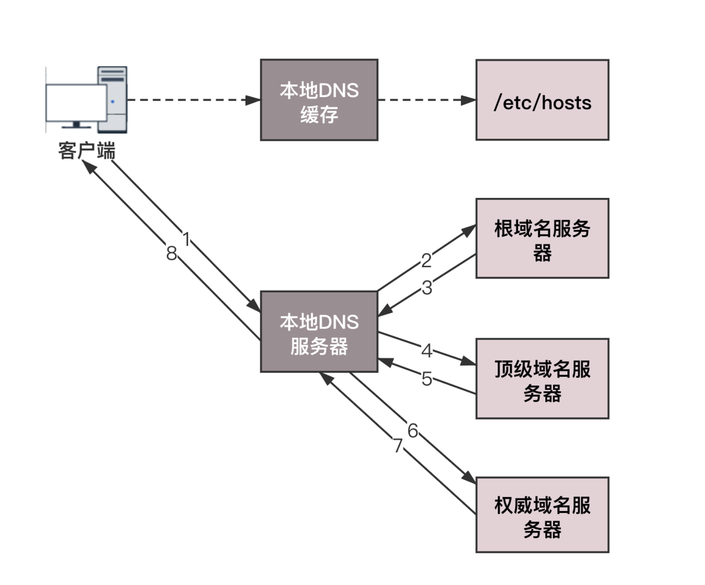

# DNS 查询

[[toc]]

## DNS 解析流程



向浏览器输入一个 URL 后，首先会进行 DNS 解析为对应的 IP 地址，DNS 解析是一个漫长的过程，可以使用 DNS 缓存和 DNS prefetch 来优化。

## DNS 缓存查询机制

解析之前会查询缓存试得到 IP 地址，查询缓存的顺序为：浏览器缓存 ——> hosts 系统缓存 ——> 路由器缓存 ——> ISP DNS 缓存（互联网服务提供商 DNS 缓存）。

如果没有缓存就继续递归查询 ——> 根域名服务器 ——> 顶级域名服务器 ——> 主域名服务器 ——> 保存结果至缓存；如果提前设置了 DNS 缓存，那么也减少了查询的步骤。

本地 DNS 一般是你的网络服务商（ISP），如电信、移动等自动分配，它通常就在你网络服务商的某个机房。

顶级域名服务器就是大名鼎鼎的比如 .com、.net、 .org 这些一级域名，它负责管理二级域名，比如 163.com

## DNS prefetch 的原理

开启了 DNS prefetch 后，浏览器在空闲时间会提前把这些域名转换为对应的 IP 地址，缓存到系统缓存中，从而缩短 DNS 解析花费的时间，提高访问网站的速度，以下是设置 DNS prefetch 的方式：

```html
<!DOCTYPE html>
<html lang="en">
  <head>
    <meta charset="UTF-8" />
    <title>DNS prefetch</title>
    <!-- 开启DNS预解析 -->
    <meta http-equiv="x-dns-prefetch-control" content="on" />
    <link rel="dns-prefetch" href="//cdn.boblog.com" />
    <link rel="dns-prefetch" href="//images.boblog.com" />
  </head>
  <body></body>
</html>
```
