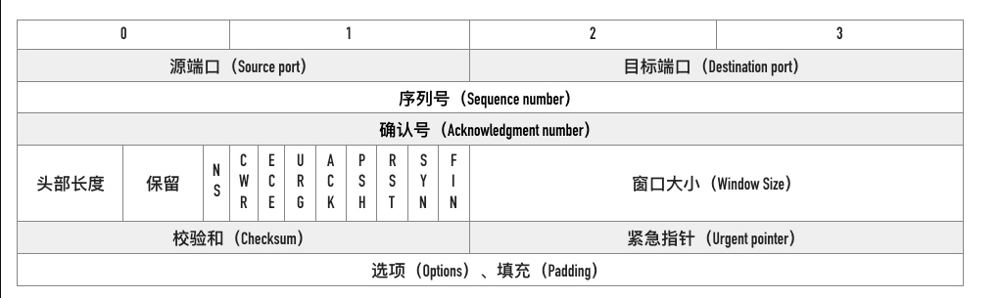

# TCP 协议

[[toc]]

## TCP && UDP

### UDP

属于通信传输流中的传输层，UDP 是面向无连接的，传输双方没有确认机制，也就是说你要传就传吧，没有 HTTP 那样需要事先三从握手。缺点是不能保证数据传输的可靠性；优点是报文头信息少开销小，支持一对多、多对多、多对一的传输方式，传输实时性强。常用于直播以及游戏。

### TCP

TCP（Transmission Control Protocol，传输控制协议）是一种面向连接的、可靠的、基于字节流的传输层通信协议。相对于 UDP，TCP 有下面两个特点：

- 对于数据包丢失的情况，TCP 提供重传机制；
- TCP 引入了数据包排序机制，用来保证把乱序的数据包组合成一个完整的文件。

### UDP 与 TCP 的区别是什么

首先 UDP 协议是面向无连接的，也就是说不需要在正式传递数据之前先连接起双方。然后 UDP 协议只是数据报文的搬运工，不保证有序且不丢失的传递到对端，并且 UDP 协议也没有任何控制流量的算法，总的来说 UDP 相较于 TCP 更加的轻便。

## TCP 三次握手和四次挥手

### 为什么发起 HTTP 请求前需要 TCP 三次握手

为了让客户端和服务端都能确定彼此**发起**和**响应**的能力是否靠谱。

- 第一次：客户端发 SYN 给服务度
- 第二次：服务端发 SYN/ACK 给客户端
- 第三次：客户端发 ACK 给服务端

SYN 是同步，ACK 为确认； SYN 是包的序列号，对方回复时 ACK 会加 1。 SYN 和 ACK 的起始位置不同，因为网络有延迟、复制重发，会丢失。

### 三次握手

三次握手的目标：

- 同步 sequence 序列
  - 初始化序列 ISN
- 交换 TCP 通讯参数
  - 如 MSS、窗口比例因子、选择性确认、指定校验和算法

### ISN 能设置成一个固定值吗

不能，TCP 连接四元组（源 IP、源端口号、目标 IP、目标端口号）唯一确定，所以就算所有的连接 ISN 都是一个固定的值，连接之间也是不会互相干扰的。但是会有几个严重的问题

1. 出于安全性考虑。如果被知道了连接的 ISN，很容易构造一个在对方窗口内的序列号，源 IP 和源端口号都很容易伪造，这样一来就可以伪造 RST 包，将连接强制关闭掉了。如果采用动态增长的 ISN，要想构造一个在对方窗口内的序列号难度就大很多了。

2. 因为开启 SO_REUSEADDR 以后端口允许重用，收到一个包以后不知道新连接的还是旧连接的包因为网络的原因姗姗来迟，造成数据的混淆。如果采用动态增长的 ISN，那么可以保证两个连接的 ISN 不会相同，不会串包。

### 四次挥手

> [深入理解 TCP 协议](https://juejin.im/book/5c70dbbe51882562046911bc/section/5cf5f583e51d4558936aa033)

1. 客户端调用 close 方法，执行「主动关闭」，会发送一个 FIN 报文给服务端，从这以后客户端不能再发送数据给服务端了，客户端进入 FIN-WAIT-1 状态。FIN 报文其实就是将 FIN 标志位设置为 1。

2. 服务端收到 FIN 包以后回复确认 ACK 报文给客户端，服务端进入 CLOSE_WAIT，客户端收到 ACK 以后进入 FIN-WAIT-2 状态。

3. 服务端也没有数据要发送了，发送 FIN 报文给客户端，然后进入 LAST-ACK 状态，等待客户端的 ACK。同前面一样如果 FIN 段没有携带数据，也需要消耗一个序列号。

4. 客户端收到服务端的 FIN 报文以后，回复 ACK 报文用来确认第三步里的 FIN 报文，进入 TIME_WAIT 状态，等待 2 个 MSL 以后进入 CLOSED 状态。服务端收到 ACK 以后进入 CLOSED 状态。TIME_WAIT 是一个很神奇的状态，后面有文章会专门介绍。

### 为什么挥手要四次，变为三次可以吗

当然可以，因为有延迟确认的存在，把第二步的 ACK 经常会跟随第三步的 FIN 包一起捎带会对端。

发送 FIN 包以后，会进入半关闭（half-close）状态，表示自己不会再给对方发送数据了。因此如果服务端收到客户端发送的 FIN 包以后，只能表示客户端不会再给自己发送数据了，但是服务端这个时候是可以给客户端发送数据的。

在这种情况下，如果不及时发送 ACK 包，死等服务端这边发送数据，可能会造成客户端不必要的重发 FIN 包

如果服务端确定没有什么数据需要发给客户端，那么当然是可以把 FIN 和 ACK 合并成一个包，四次挥手的过程就成了三次。

## TCP 快速打开的原理(TFO)

TFO 是在原来 TCP 协议上的扩展协议，它的主要原理就在发送第一个 SYN 包的时候就开始传数据了，不过它要求当前客户端之前已经完成过「正常」的三次握手。

- 客户端发送一个 SYN 包，头部包含 Fast Open 选项，且该选项的 Cookie 长度为 0
- 服务端根据客户端 IP 生成 cookie，放在 SYN+ACK 包中一同发回客户端
- 客户端收到 Cookie 以后缓存在自己的本地内存
- 客户端再次访问服务端时，在 SYN 包携带数据，并在头部包含 上次缓存在本地的 TCP cookie
- 如果服务端校验 Cookie 合法，则在客户端回复 ACK 前就可以直接发送数据。如果 Cookie 不合法则按照正常三次握手进行。

## SYN flood 攻击

SYN Flood 攻击原理

SYN Flood 属于典型的 DoS/DDoS 攻击。其攻击的原理很简单，就是用客户端在短时间内伪造大量不存在的 IP 地址，并向服务端疯狂发送 SYN。对于服务端而言，会产生两个危险的后果:

- 处理大量的 SYN 包并返回对应 ACK, 势必有大量连接处于 SYN_RCVD 状态，从而占满整个半连接队列，无法处理正常的请求。
- 由于是不存在的 IP，服务端长时间收不到客户端的 ACK，会导致服务端不断重发数据，直到耗尽服务端的资源。

如何应对 SYN Flood 攻击？

- 增加 SYN 连接，也就是增加半连接队列的容量。
- 减少 SYN + ACK 重试次数，避免大量的超时重发。
- 利用 SYN Cookie 技术，在服务端接收到 SYN 后不立即分配连接资源，而是根据这个 SYN 计算出一个 Cookie，连同第二次握手回复给客户端，在客户端回复 ACK 的时候带上这个 Cookie 值，服务端验证 Cookie 合法之后才分配连接资源。

## TCP 报文头部的字段

### 源端口、目标端口

### 序列号

TCP 是面向字节流的协议，通过 TCP 传输的字节流的每个字节都分配了序列号，序列号（Sequence number）指的是本报文段第一个字节的序列号。 8 位 2 进制被称为一个字节。

序列号在 TCP 通信的过程中有两个作用:

- 在 SYN 报文中交换彼此的初始序列号。
- 保证数据包按正确的顺序组装。

### 标记位

最常见的有下面这几个：

- SYN（Synchronize）：用于发起连接数据包同步双方的初始序列号
- ACK（Acknowledge）：确认数据包
- RST（Reset）：这个标记用来强制断开连接，通常是之前建立的连接已经不在了、包不合法、或者实在无能为力处理
- FIN（Finish）：通知对方我发完了所有数据，准备断开连接，后面我不会再发数据包给你了。
- PSH（Push）：告知对方这些数据包收到以后应该马上交给上层应用，不能缓存起来。

### 确认号

关于确认号有几个注意点：

- 不是所有的包都需要确认的
- 不是收到了数据包就立马需要确认的，可以延迟一会再确认
- ACK 包本身不需要被确认，否则就会无穷无尽死循环了
- 确认号永远是表示小于此确认号的字节都已经收到

### 可选项

常用的可选项有以下几个:

- TimeStamp: TCP 时间戳，后面详细介绍。
- MSS: 指的是 TCP 允许的从对方接收的最大报文段。
- SACK: 选择确认选项。
- Window Scale： 窗口缩放选项。

## TCP 的队头阻塞

虽然 HTTP/2 解决了应用层面的队头阻塞问题，不过和 HTTP/1.1 一样，HTTP/2 依然是基于 TCP 协议的，而 TCP 最初就是为了单连接而设计的。你可以把 TCP 连接看成是两台计算机之前的一个虚拟管道，计算机的一端将要传输的数据按照顺序放入管道，最终数据会以相同的顺序出现在管道的另外一头。

从一端发送给另外一端的数据会被拆分为一个个按照顺序排列的数据包，这些数据包通过网络传输到了接收端，接收端再按照顺序将这些数据包组合成原始数据，这样就完成了数据传输。

如果在数据传输的过程中，有一个数据因为网络故障或者其他原因而丢包了，那么整个 TCP 的连接就会处于暂停状态，需要等待丢失的数据包被重新传输过来。你可以把 TCP 连接看成是一个按照顺序传输数据的管道，管道中的任意一个数据丢失了，那之后的数据都需要等待该数据的重新传输。

## TCP 的流量控制

TCP 会把要发送的数据放入发送缓冲区（Send Buffer)，接收到的数据放入接收缓冲区（Receive Buffer），应用程序会不停的读取接收缓冲区的内容进行处理。流量控制做的事情就是，如果接收缓冲区已满，发送端应该停止发送数据。

TCP 滑动窗口分为两种: **发送窗口**和**接收窗口**。

### TCP 滑动窗口

## TCP 拥塞控制

TCP 每条连接都需要维护两个核心状态:

- 拥塞窗口（Congestion Window，cwnd）
- 慢启动阈值（Slow Start Threshold，ssthresh）

涉及到的算法有这几个:

- 慢启动
- 拥塞避免。也就是慢启动的阈值。
- 快速重传与快速恢复

### 拥塞窗口

- 接收窗口(rwnd)是接收端给的限制
- 拥塞窗口(cwnd)是发送端的限制

限制的是发送窗口的大小。

如何来计算发送窗口？取两者的较小值。而拥塞控制，就是来控制 cwnd 的变化。

### 慢启动

慢启动运作过程如下:

- 首先，三次握手，双方宣告自己的接收窗口大小
- 双方初始化自己的拥塞窗口(cwnd)大小
- 在开始传输的一段时间，发送端每收到一个 ACK，拥塞窗口大小加 1，也就是说，每经过一个 RTT，cwnd 翻倍。如果说初始窗口为 10，那么第一轮 10 个报文传完且发送端收到 ACK 后，cwnd 变为 20，第二轮变为 40，第三轮变为 80，依次类推。

难道就这么无止境地翻倍下去？当然不可能。

慢启动阈值:

- 当 cwnd < ssthresh 时，拥塞窗口按指数级增长（慢启动）
- 当 cwnd > ssthresh 时，拥塞窗口按线性增长（拥塞避免）

### 拥塞避免

原来每收到一个 ACK，cwnd 加 1，现在到达阈值了，cwnd 只能加这么一点: 1 / cwnd。

### 快速重传

快速重传的含义是：当接收端收到一个不按序到达的数据段时，TCP 立刻发送 1 个重复 ACK，而不用等有数据捎带确认，当发送端收到 3 个或以上重复 ACK，就意识到之前发的包可能丢了，于是马上进行重传，不用傻傻的等到重传定时器超时再重传。

### 快速恢复

当然，发送端收到三次重复 ACK 之后，发现丢包，觉得现在的网络已经有些拥塞了，自己会进入快速恢复阶段。

在这个阶段，发送端如下改变：

- 拥塞阈值降低为 cwnd 的一半
- cwnd 的大小变为拥塞阈值
- cwnd 线性增加

## TCP 的流量控制

## 性能检测清单（TCP）

- 把服务器升级到最新版本（Linux：3.2+）；
- 确保 cwnd 的大小为 10；
- 禁用空闲后的慢启动；
- 确保启动窗口缩放；
- 减少传输冗余数据；
- 压缩要传输的数据；
- 把服务器放到离用户近的地方，减少往返时间；
- 尽最大可能重用已经建立的 TCP 连接。

## 资料

- 《web 性能权威指南》
- [TCP 协议灵魂之问，巩固你的网路底层基础](https://juejin.cn/post/6844904070889603085)
- [深入理解 TCP 协议：从原理到实战](https://juejin.cn/book/6844733788681928712)
- [浏览器工作原理与实践](https://time.geekbang.org/column/intro/216)
