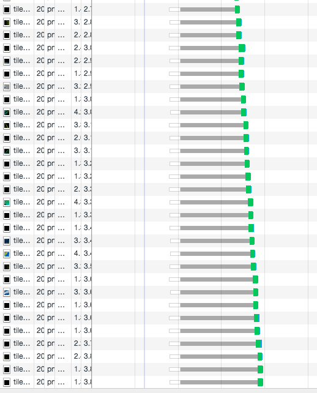

# 网络协议

[[toc]]

### UDP

属于通信传输流中的传输层，UDP 是面向无连接的，传输双方没有确认机制，也就是说你要传就传吧，没有 HTTP 那样需要事先三从握手。
缺点是不能保证数据传输的可靠性；优点是报文头信息少开销小，支持一对多、多对多、多对一的传输方式，传输实时性强。常用于直播以及游戏。

### TCP

TCP（Transmission Control Protocol，传输控制协议）是一种面向连接的、可靠的、基于字节流的传输层通信协议。相对于 UDP，TCP 有下面两个特点：

- 对于数据包丢失的情况，TCP 提供重传机制；
- TCP 引入了数据包排序机制，用来保证把乱序的数据包组合成一个完整的文件。

**TCP 的队头阻塞**

虽然 HTTP/2 解决了应用层面的队头阻塞问题，不过和 HTTP/1.1 一样，HTTP/2 依然是基于 TCP 协议的，而 TCP 最初就是为了单连接而设计的。你可以把 TCP 连接看成是两台计算机之前的一个虚拟管道，计算机的一端将要传输的数据按照顺序放入管道，最终数据会以相同的顺序出现在管道的另外一头。


从一端发送给另外一端的数据会被拆分为一个个按照顺序排列的数据包，这些数据包通过网络传输到了接收端，接收端再按照顺序将这些数据包组合成原始数据，这样就完成了数据传输。

如果在数据传输的过程中，有一个数据因为网络故障或者其他原因而丢包了，那么整个 TCP 的连接就会处于暂停状态，需要等待丢失的数据包被重新传输过来。你可以把 TCP 连接看成是一个按照顺序传输数据的管道，管道中的任意一个数据丢失了，那之后的数据都需要等待该数据的重新传输。

### UDP 与 TCP 的区别是什么

首先 UDP 协议是面向无连接的，也就是说不需要在正式传递数据之前先连接起双方。然后 UDP 协议只是数据报文的搬运工，不保证有序且不丢失的传递到对端，并且 UDP 协议也没有任何控制流量的算法，总的来说 UDP 相较于 TCP 更加的轻便。

### HTTP/0.9

- 第一个是只有一个请求行，并没有 HTTP 请求头和请求体，因为只需要一个请求行就可以完整表达客户端的需求了。

- 第二个是服务器也没有返回头信息，这是因为服务器端并不需要告诉客户端太多信息，只需要返回数据就可以了。
- 第三个是返回的文件内容是以 ASCII 字符流来传输的，因为都是 HTML 格式的文件，所以使用 ASCII 字节码来传输是最合适的。

### HTTP/1.0

- HTTP/1.0 引入了请求头和响应头，已 Key-Value 形式保存；
- 文件格式不仅仅局限于 ASCII 编码，还有很多其他类型编码的文件；
- 引入了状态码；
- 增加了各种不同类型的文件
- 服务器会对数据进行压缩后再传输
- 为了减轻服务器的压力，在 HTTP/1.0 中提供了 Cache 机制，用来缓存已经下载过的数据。
- 服务器需要统计客户端的基础信息，比如 Windows 和 macOS 的用户数量分别是多少，所以 HTTP/1.0 的请求头中还加入了用户代理的字段

请求头中可以如下设置：

```
accept: text/html
accept-encoding: gzip, deflate, br // 压缩形式
accept-Charset: ISO-8859-1,utf-8
accept-language: zh-CN,zh
```

响应头的数据信息：

```
content-encoding: br
content-type: text/html; charset=UTF-8
```

### HTTP/1.1

#### 1. 改进持久连接

HTTP/1.0 每进行一次 HTTP 通信，都需要经历建立 TCP 连接、传输 HTTP 数据和断开 TCP 连接三个阶段。

HTTP/1.1 中增加了持久连接的方法，它的特点是在一个 TCP 连接上可以传输多个 HTTP 请求，只要浏览器或者服务器没有明确断开连接，那么该 TCP 连接会一直保持。

目前浏览器中对于同一个域名，默认允许同时建立 6 个 TCP 持久连接

#### 2. 不成熟的 HTTP 管线化

由于各种原因，管线化技术最终被各大厂商放弃了。不过 1.1 是支持管线化的。

#### 3. 提供虚拟主机的支持

一台物理主机上绑定多个虚拟主机，每个虚拟主机都有自己的单独的域名，这些单独的域名都公用同一个 IP 地址。

HTTP/1.1 的请求头中增加了 Host 字段，用来表示当前的域名地址，这样服务器就可以根据不同的 Host 值做不同的处理。

#### 4. 对动态生成的内容提供了完美支持

浏览器判断数据包是否接收完成，不完全依赖 Content-Length 字段，服务器会将数据分割成若干个任意大小的数据块，每个数据块发送时会附上上个数据块的长度，最后使用一个零长度的块作为发送数据完成的标志。

#### 5. 户端 Cookie、安全机制

> 总结： HTTP/1.1，增加了持久连接方法来提升连接效率，同时还尝试使用管线化技术提升效率（不过由于各种原因，管线化技术最终被各大厂商放弃了）。除此之外，HTTP/1.1 还引入了 Cookie、虚拟主机的支持、对动态内容的支持等特性

### HTTP/1.1 的主要问题

**第一个原因，TCP 的慢启动。**

TCP 的慢启动：TCP刚启动时，不知道网络中的情况，刚开始的发送窗口比较少，在没有丢包的情况会依次增加。

> 丢包为依据，或探测带宽为依据

**第二个原因，同时开启了多条 TCP 连接，那么这些连接会竞争固定的带宽。**

拥塞避免：

**第三个原因，HTTP/1.1 队头阻塞的问题。**

如果 TCP 通道中的某个请求因为某些原因没有及时返回，那么就会阻塞后面的所有请求，这就是著名的队头阻塞的问题。

> 慢启动和 TCP 连接之间相互竞争带宽是由于 TCP 本身的机制导致的，而队头阻塞是由于 HTTP/1.1 的机制导致的。

### HTTP/2

在 HTTP/1 中，因为队头阻塞的原因，你会发现发送请求是长这样的



在 HTTP/2 中，因为可以复用同一个 TCP 连接，你会发现发送请求是长这样的


#### 1. 多路复用

在 HTTP/2 中，有两个非常重要的概念，分别是帧（frame）和流（stream）。

帧代表着最小的数据单位，每个帧会标识出该帧属于哪个流，流也就是多个帧组成的数据流。

多路复用，就是在一个 TCP 连接中可以存在多条流。换句话说，也就是可以发送多个请求，对端可以通过帧中的标识知道属于哪个请求。可以避免 HTTP 旧版本中的队头阻塞问题，极大的提高传输性能。

<!--  -->

#### 2. 二进制传输

HTTP/2 中所有加强性能的核心点在于此。在之前的 HTTP 版本中，我们是通过文本的方式传输数据。在 HTTP/2 中引入了新的编码机制，所有传输的数据都会被分割，并采用二进制格式编码。

数据经过二进制分帧层处理之后，会被转换为一个个带有请求 ID 编号的帧，通过协议栈将这些帧发送给服务器。反向也是如此。

<!--  -->

#### 3.Header 压缩

不是对相应数据压缩，是对头部信息进行压缩。

#### 4. 服务端 Push

服务器知道该 HTML 页面会引用几个重要的 JavaScript 文件和 CSS 文件，那么在接收到 HTML 请求之后，附带将要使用的 CSS 文件和 JavaScript 文件一并发送给浏览器，这样当浏览器解析完 HTML 文件之后，就能直接拿到需要的 CSS 文件和 JavaScript 文件，

#### 5. 可以设置请求的优先级

> http/2 是没必要用雪碧图了；
>
> 虽然 HTTP/2 解决了 HTTP/1.1 中的队头阻塞问题，但是 HTTP/2 依然是基于 TCP 协议的，而 TCP 协议依然存在数据包级别的队头阻塞问题

### HTTP/3

QUIC 虽然基于 UDP，但是在原本的基础上新增了很多功能，比如多路复用、0-RTT、使用 TLS1.3 加密、流量控制、有序交付、重传等等功能。

HTTP/3 中的 QUIC 协议集合了以下几点功能：

**实现了类似 TCP 的流量控制、传输可靠性的功能。**虽然 UDP 不提供可靠性的传输，但 QUIC 在 UDP 的基础之上增加了一层来保证数据可靠性传输。它提供了数据包重传、拥塞控制以及其他一些 TCP 中存在的特性。

**集成了 TLS 加密功能。**目前 QUIC 使用的是 TLS1.3，相较于早期版本 TLS1.3 有更多的优点，其中最重要的一点是减少了握手所花费的 RTT 个数。

**实现了 HTTP/2 中的多路复用功能。**和 TCP 不同，QUIC 实现了在同一物理连接上可以有多个独立的逻辑数据流（如下图）。实现了数据流的单独传输，就解决了 TCP 中队头阻塞的问题。


**实现了快速握手功能。**由于 QUIC 是基于 UDP 的，所以 QUIC 可以实现使用 0-RTT 或者 1-RTT 来建立连接，这意味着 QUIC 可以用最快的速度来发送和接收数据，这样可以大大提升首次打开页面的速度。

> 三次握手就是 1.5 个 RTT；

### 一个 Tcp 连接能发几个 http 请求

如果是 HTTP 1.0 版本协议，一般情况下，不支持长连接，因此在每次请求发送完毕之后，TCP 连接即会断开，因此一个 TCP 发送一个 HTTP 请求，但是有一种情况可以将一条 TCP 连接保持在活跃状态，那就是通过 Connection 和 Keep-Alive 首部，在请求头带上 Connection: Keep-Alive，并且可以通过 Keep-Alive 通用首部中指定的，用逗号分隔的选项调节 keep-alive 的行为，如果客户端和服务端都支持，那么其实也可以发送多条，不过此方式也有限制，Chrome 限制是 6 个。

而如果是 HTTP 1.1 版本协议，支持了长连接，因此只要 TCP 连接不断开，便可以一直发送 HTTP 请求，持续不断，没有上限； 同样，如果是 HTTP 2.0 版本协议，支持多用复用，一个 TCP 连接是可以并发多个 HTTP 请求的，同样也是支持长连接，因此只要不断开 TCP 的连接，HTTP 请求数也是可以没有上限地持续发送

### HTTPS

- HTTPS 还是通过了 HTTP 来传输信息，但是信息通过 TLS 协议进行了加密。
- 在 TLS 中使用了两种加密技术，分别为：对称加密和非对称加密。
- 在传输数据阶段依然使用对称加密，但是对称加密的密钥我们采用非对称加密来传输
- 浏览器端先验证证书，验证了证书之后，才继续后续流程。

#### TLS 握手


#### 数字证书 CA

已极客时间为例：

- 首先极客时间需要准备一套私钥和公钥，私钥留着自己使用；
- 然后极客时间向 CA 机构提交公钥、公司、站点等信息并等待认证，这个认证过程可能是收费的；
- CA 通过线上、线下等多种渠道来验证极客时间所提供信息的真实性，如公司是否存在、企业是否合法、域名是否归属该企业等；
- 如信息审核通过，CA 会向极客时间签发认证的数字证书，包含了极客时间的公钥、组织信息、CA 的信息、有效时间、证书序列号等，这些信息都是明文的，同时包含一个 CA 生成的签名。

> 首先 CA 使用 Hash 函数来计算极客时间提交的明文信息，并得出信息摘要；然后 CA 再使用它的私钥对信息摘要进行加密，加密后的密文就是 CA 颁给极客时间的数字签名。

### http 和 https 的区别

- url 开头不一致是最明显的区分；
- 其次 http 没有 https 安全，http 没有经过 SSL/TLS 加密、身份验证；
- 还有默认的端口不一样，http 是 80、https 是 443，https 需要证书，https 是防止中间人攻击方式的一种。

### 什么是持久连接以及管线化

持久连接：在 HTTP/1.1 之前的时代，每一次 HTTP 请求就需要先 TCP 建立三次握手，传输完毕后就断开连接，会增加很多的通信开销。

HTTP/1.1 增加了持久连接，也就是说在一次 TCP 连接里面可以发送多次 HTTP 请求，只要任意一端没有明确提出断开连接，则保持 TCP 的连接状态，也就是响应头里面的 Connection:keep-alive。

管线化：在持久连接里处理 HTTP 的方式是，发送响应完成后才能发起下一个请求，而管线化解决的问题是可以一次发起多个 HTTP 请求，且可以同时返回多次响应结果。

### 为什么发起 HTTP 请求前需要 TCP 三次握手

为了让客户端和服务端都能确定彼此**发起**和**响应**的能力是否靠谱。

- 第一次：客户端发SYN给服务度
- 第二次：服务端发SYN/ACK给客户端
- 第三次：客户端发ACK给服务端

SYN是同步，ACK为确认；
SYN是包的序列号，对方回复时ACK会加1。
SYN和ACK的起始位置不同，因为网络有延迟、复制重发，会丢失。为了避免相互影响，会是随机的。

### 三次握手

三次握手的目标：

- 同步sequence 序列
  - 初始化序列ISN
- 交换TCP通讯参数
  - 如MSS、窗口比例因子、选择性确认、指定校验和算法

### 为什么关闭 HTTP 请求前需要 TCP 四次挥手

关闭连接是双向的，客户端和服务器都可以提出，四次挥手是为了**不让关闭太仓促**，保证可靠性。
如客户端首先会告知服务器申请关闭连接，服务器收到后告诉客户端收到了，不过我还没有准备好，让客户端等等。服务端数据发送数据完毕后，再次告诉客户端，我准备关闭连接了。客户端收到后怕网络不好，服务器不知道要关闭，所以第四次发送信息确认，服务器收到后断开连接，客户端也断开连接。具体过程：

- 客户端发送请求给服务端，申请主动断开连接，进入等待状态，不在往服务端发送数据，但是接收数据（客户端：我要断开连接了）
- 服务端收到后，告知客户端知道了，服务端进行等待状态，不在接收数据，但是可以继续发送数据（服务端：好，我知道了，但是要等一等）
- 客户端收到服务端的告知后，进入下一阶段的等待。（客户端：好，我等）
- 服务端完成剩余数据的发送后，告知客户端可以断开了，服务端不接收和读取数据（服务端：你可以断开了）
- 客户端收到后，告知服务端，已收到，然后释放链接（客户端：好的，我断开链接了）
- 服务端收到后，也释放链接

### HTTP 请求报文和响应报文里分别有什么

报文的结构大致是两部分，报文首部，一个空行，和报文主体，报文主体不一定非要有。
请求报文：包括了请求行，里面包括请求的方法，协议版本；各种首部的字段，例如服务器域名、客户端信息、缓存信息、压缩传输的方式等。
响应报文：包括了状态行，协议版本，响应的状态码；各种首部的字段，如 ETag、日期、内容类型等，以及响应的报文主体。

### 常见的响应状态码有哪些

大致可以分为 2 开头表示成功、3 开头表示重定向、4 开头客户端错误、5 开头服务器错误。

- 204：如当浏览器发出请求处理后，返回 204 响应，表示客户端显示的页面不发生更新。
- 206：客户端只要想要响应内容中的一部分，服务端成功执行了这次响应。响应报文中的 Content-Range 则指定了哪部分的内容。
- 301：永久重定向，表示请求的资源已被分配到了新的 URI，以后使用新的吧
- 302：临时重定向，表示请求的资源已被分配到了新的 URI，现在使用新的吧
- 303：临时重定向，表示请求的资源已被分配到了新的 URI，请使用 get 方法获取资源。
- 304：服务端找不到根据客户端发送附带条件的请求。（附带条件指 get 请求报文中包含 If-Match、If-Modified-Since、If-None-Match、If-Range、If-Unmodified-Since 中的一个）
- 400：请求报文存在语法错误。
- 403：请求资源被服务器拒绝。
- 503：表明服务器暂时处于超负载或正在停机维护，无法处理请求。

### get 和 post 的区别

- get 回退不会重新发起请求，post 会；
- get 默认会被浏览器主动缓存，post 不会；
- get 只能进行 url 编码，post 支持多种编码方式；
- get 的请求参数会被拼接到 url 后面，post 放在 request-body 中；
- get 产生一个 tcp 数据包，post 会产生两个 tcp 包；
- get 主要是应用为获取资源，post 主要是应用于传输或修改资源。

### 什么情况会触发 options 请求

options 通常用于，在跨域请求前发起预检请求，以检测请求是否被服务器接受。

跨域请求中分为简单请求和预检请求两种，符合以下条件可视为简单请求：

- 使用的 HTTP method 是 `GET POST HEAD`
- content-type 是 `text/plain mutipart/form-data application/x-www-form-urlencode` 三种之一

除去简单请求外，其他请求就会先触发预检请求。

常见的，比如使用

- content-Type 为 application/xml 或 text/xml 的 POST 请求
- 设置自定义头，比如 X-JSON、X-MENGXIANHUI 等

预检请求返回的头部报文中有

- Access-Control-Allow-Origin： 服务器可接受的请求来源
- Access-Control-Request-Method： 服务器实际请求所使用的 HTTP 方法
- Access-Control-Request-Headers`： 服务器实际请求所携带的自定义首部字段。

客户端基于从预检请求获得的信息来判断，是否继续执行跨域请求。

> 注意：跨域请求若想发送 cookie 信息，需要服务端设置 resp.setHeader("Access-Control-Allow-Credentials","true"); 客户端设置 withCredentials: true

参考资料： [跨域请求](https://cloud.tencent.com/developer/news/397683)


### 主要参考：

- 《Web协议详解与抓包实战》
- 《浏览器工作原理与实践》
- 《趣谈网络协议》
- 《深入理解 TCP 协议：从原理到实战》