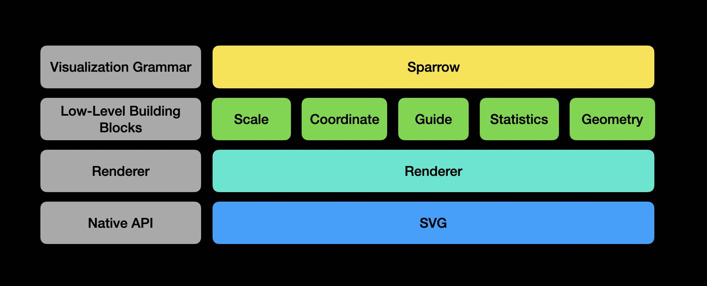

# 数据可视化

[[toc]]

## 可视化介绍

- [Navigating the Wide World of Data Visualization Libraries](https://medium.com/nightingale/navigating-the-wide-world-of-web-based-data-visualization-libraries-798ea9f536e7)

## 可视化库

### sparrow

A tiny plot library based on the grammar of graphics for learning purpose. 🦜



### Rough.js

https://roughjs.com/

### react-three-fiber

- [react-three-fiber](https://github.com/pmndrs/react-three-fiber)
- [docs.pmnd.rs/react-three-fiber](https://docs.pmnd.rs/react-three-fiber/getting-started/introduction)

```js
import ReactDOM from 'react-dom';
import React, { useRef, useState } from 'react';
import { Canvas, useFrame } from '@react-three/fiber';

function Box(props) {
  // This reference will give us direct access to the mesh
  const mesh = useRef();
  // Set up state for the hovered and active state
  const [hovered, setHover] = useState(false);
  const [active, setActive] = useState(false);
  // Subscribe this component to the render-loop, rotate the mesh every frame
  useFrame((state, delta) => (mesh.current.rotation.x += 0.01));
  // Return view, these are regular three.js elements expressed in JSX
  return (
    <mesh
      {...props}
      ref={mesh}
      scale={active ? 1.5 : 1}
      onClick={(event) => setActive(!active)}
      onPointerOver={(event) => setHover(true)}
      onPointerOut={(event) => setHover(false)}
    >
      <boxGeometry args={[1, 1, 1]} />
      <meshStandardMaterial color={hovered ? 'hotpink' : 'orange'} />
    </mesh>
  );
}

ReactDOM.render(
  <Canvas>
    <ambientLight />
    <pointLight position={[10, 10, 10]} />
    <Box position={[-1.2, 0, 0]} />
    <Box position={[1.2, 0, 0]} />
  </Canvas>,
  document.getElementById('root')
);
```
