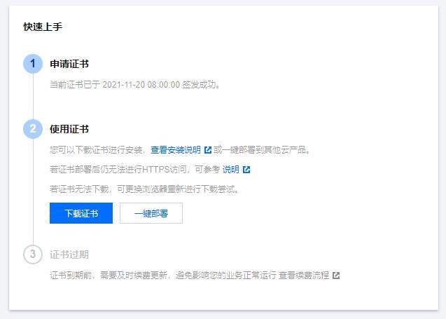
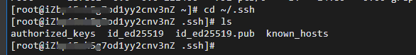
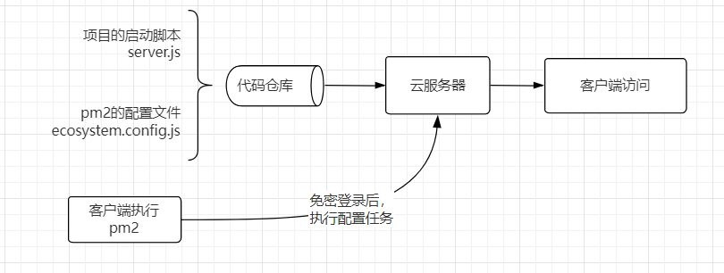

# 部署一个静态网站

在阿里云 ecs 部署一点前端静态服务器。使用的环境为 linux、nginx、node 以及 pm2。

[[toc]]

## nginx

linux 下安装

```sh
yum -y install nginx-1.16.1
```

相关命令

```sh
nginx -v

# 启动
nginx

# 查看nginx都安装到了哪些目录
rpm -ql nginx

# 进入配置文件，不同的部署方式目录不同
cd /etc/nginx/conf.d

# 关闭
nginx -s stop

# 重新启动
nginx -s reload

# 查询80端口占用
netstat -ntpl | grep 80

# 杀死所有nginx进程
killall nginx

# 查看nginx进程
ps aux | grep nginx

# 检查nginx配置
nginx -t
```

进入`/etc/nginx/conf.d`目录后

新建一个问价夹，创建`blog-xxx-com-3000.conf`文件，为了方便管理，文件名建议和域名一致。

```sh
# 创建文件
touch blog-xxx-com-3000
# 打开文件编辑
vim blog-xxx-com-3000
```

在创建好的文件中写入内容。

```conf
upstream fe_blog {
  server  127.0.0.1:3000;
}
server {
  listen 80;
  server_name blog.xxx.com;
  return 301 https://$host$request_uri;
}
server {
  #SSL 访问端口号为 443
  listen 443 ssl;
  #填写绑定证书的域名
  server_name blog.xxx.com;
  #证书文件名称 /www/ssl/为证书路劲
  ssl_certificate /www/ssl/1_blog.xxx.com_bundle.crt;
  #私钥文件名称
  ssl_certificate_key /www/ssl/2_blog.xxx.com.key;
  ssl_session_timeout 5m;
  #请按照以下协议配置
  ssl_protocols TLSv1 TLSv1.1 TLSv1.2;
  #请按照以下套件配置，配置加密套件，写法遵循 openssl 标准。
  ssl_ciphers ECDHE-RSA-AES128-GCM-SHA256:HIGH:!aNULL:!MD5:!RC4:!DHE;
  ssl_prefer_server_ciphers on;
  location / {
    proxy_pass          http://fe_blog;
    proxy_set_header    host             $host;
    proxy_set_header    X-Real-IP        $remote_addr;
    proxy_set_header    X-Forwarded-For  $proxy_add_x_forwarded_for;
    proxy_set_header    X-NginX-Proxy    true;
  }
}
```

写入完成后，按键盘`esc`退出，按 `shift + :` 和 `wq!`保存退出。然后查看配置并检查配置是否有错误。

```sh
cat blog-xxx-com-3000
nginx -t
```

以上配置将 nginx 作为代理服务器使用，将 3000 端口下的 http 服务反向代理到`https://blog.xxx.com`域名下。如果将静态直接部署到 nginx 下，使用以下配置：

```js
server {
    listen 80;
    # gzip config
    gzip on;
    gzip_min_length 1k;
    gzip_comp_level 9;
    gzip_types text/plain application/javascript application/x-javascript text/css application/xml text/javascript application/x-httpd-php image/jpeg image/gif image/png;
    gzip_vary on;
    gzip_disable "MSIE [1-6]\.";

    root /usr/share/nginx/html;

    location / {
        # 用于配合 browserHistory使用
        try_files $uri $uri/ /index.html;

        # 如果有资源，建议使用 https + http2，配合按需加载可以获得更好的体验
        # rewrite ^/(.*)$ https://preview.pro.ant.design/$1 permanent;

    }
    location /api {
        proxy_pass https://ant-design-pro.netlify.com;
        proxy_set_header   X-Forwarded-Proto $scheme;
        proxy_set_header   X-Real-IP         $remote_addr;
    }
}

server {
  # 如果有资源，建议使用 https + http2，配合按需加载可以获得更好的体验
  listen 443 ssl http2 default_server;

  # 证书的公私钥
  ssl_certificate /path/to/public.crt;
  ssl_certificate_key /path/to/private.key;

  location / {
        # 用于配合 browserHistory使用
        try_files $uri $uri/ /index.html;

  }
  location /api {
      proxy_pass https://ant-design-pro.netlify.com;
      proxy_set_header   X-Forwarded-Proto $scheme;
      proxy_set_header   Host              $http_host;
      proxy_set_header   X-Real-IP         $remote_addr;
  }
}
```

以上是[ant design pro 的部署](https://pro.ant.design/zh-CN/docs/deploy/)。

## 域名解析

购买域名，配置 dns 服务器地址。如果购买平台和解析平台不是一个平台，需要设置 dns 服务器。

个人一般在[dnspod](https://www.dnspod.cn/)上做域名解析。

```text
algernon.dnspod.net
cassiopeia.dnspod.net
```

添加记录


## 配置 SSL

nginx 中配置 https 时，需要配置 `ssl_certificate` 和 `ssl_certificate_key` 字段，这个两个字段是 SSL 的两个证书。SSL 证书在域名解析时需要单独购买。对于个人网站可以使用免费的 SSL 证，域名解析时按提示配置 SSL 证书。配置后在证书管理页面下载 ssl 证书即可，里面有 `Apache`、`IIS`、`Nginx`、`Tomcat` 等服务器配置时需要的证书。



下载证书后，需要将证书上传到固定 nginx 中固定的目录下。个人一般存放在自建的`www/ssl`目录下。

```sh
# 给nginx目录下上传文件
scp 1_blog.xxx.com_bundle.crt root@xx.xx.xx.xxx:/www/ssl/
scp 2_blog.xxx.com.key root@xx.xx.xx.xxx:/www/ssl/
```

## node 服务器

Linux 上安装 node，先安装[nvm](https://github.com/nvm-sh/nvm)

```js
curl -o- https://raw.githubusercontent.com/nvm-sh/nvm/v0.39.0/install.sh | bash
wget -qO- https://raw.githubusercontent.com/nvm-sh/nvm/v0.39.0/install.sh | bash
```

静态网站服务器可以使用：`pushstate-server`,新建 `server.js` 文件夹。

```js
const server = require('pushstate-server');

server.start({
  port: 3001,
  directory: './dist',
});
```

也可以使用`express`

```js
const express = require('express');
const compression = require('compression');
// 端口可以自己定义
const port = process.env.PORT || 3002;
const app = express();
// 开启 gzip 压缩
app.use(compression());
app.use(express.static('./dist'));
module.exports = app.listen(port, function(err) {
  if (err) {
    console.log(err);
    return;
  }
  console.log('Listening at ' + port + '\n');
});
```

接下来配置 pm2 自动化部署，首先配置 ssh 远程服务器免密登录。

## ssh 免密登录

> SSH 是一种网络协议，用于计算机之间的加密登录。

查看本地 `~/.ssh` 路径下是否有 ssh key，没有则生成 ssh key。

```sh
ssh-keygen -t rsa -C "xxxxx@xxxxx.com"
cat id_rsa.pub
```

`id_rsa.pub` 文件里面的内容，就是需要的公钥内容。

拿到它之后，进入阿里云服务器，同样先看看本地是否有设置好公钥，如果没有，按刚才的步骤再配置一次。



配置完成后，把之前用户本地生成的 `id_rsa.pub` 内容放入 `authorized_keys` 中，在本地命令行工具执行 `ssh root@服务器 IP`，便能直接免密登录了。

## pm2 部署

部署流程图



使用 ssh 免密登录远程服务器。

在根目录下新建文件`ecosystem.config.js`

```js
module.exports = {
  apps: [
    {
      name: 'blog', // 项目名
      script: 'server.js', // 上文创建的node服务器
    },
  ],
  deploy: {
    production: {
      user: 'root', // 阿里云用户名
      host: '47.97.10.000', // 阿里云地址
      ref: 'origin/master',
      repo: 'git@github.com:xxxx/xxxxx.git', // git仓库地址
      path: '/www/website/blog', // 阿里云上的路径 www 是个人新建的路径
      ssh_options: 'StrictHostKeyChecking=no',
      'post-deploy':
        'git reset --hard && git checkout master && git pull && npm i --production=false && npm run build && pm2 startOrReload ecosystem.config.js',
      env: {
        NODE_ENV: 'production',
      },
    },
  },
};
```

由于服务器并没有 blog 这个项目，所以我们需要初始化一下项目

```sh
pm2 deploy ecosystem.config.js production setup
```

当服务器上有该路径地址后，开始自动化执行整个流程。每次本地使用以下命令即可完成自动化部署。

```js
pm2 deploy production
```

[pm2 文档](https://pm2.keymetrics.io/docs/usage/quick-start/)

## 部署问过程遇到的问题

重启 nginx 之后，访问 ip 地址首页，有 403 错误，可以在安全组添加对应的端口。
