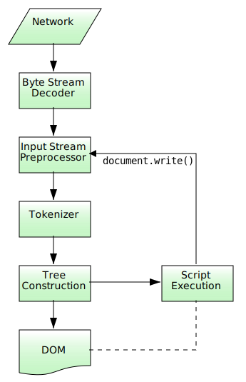

# 浏览器渲染页面

## 从 HTML 到 DOM

### 字节流解码

浏览器通过 HTTP 协议接收到的文档内容是字节数据。

这个把字节数据解码成字符数据的过程称之为“字节流解码”。

### 解析过程

## 资料

- [Parsing HTML documents](https://html.spec.whatwg.org/multipage/parsing.html#encoding-sniffing-algorithm)
