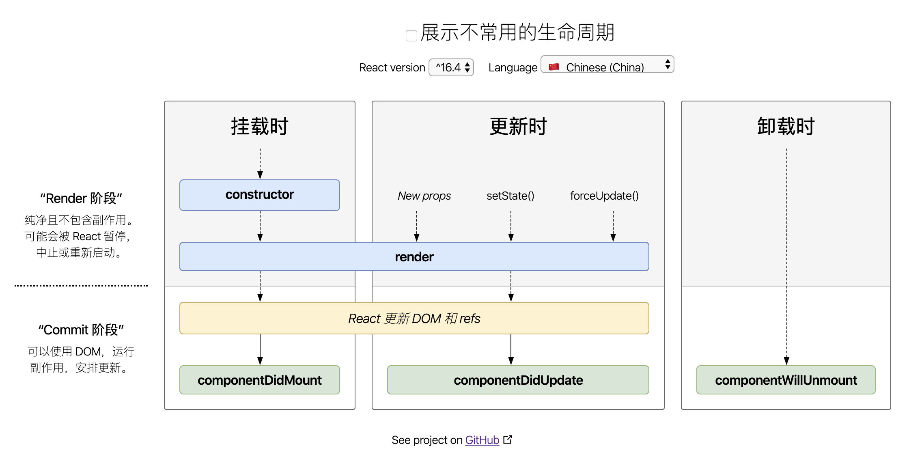

# React 基础

::: details

[[toc]]

:::

## JSX

- JSX 是一个模板语法，然后转成 js 对象，在变成真实的 DOM；
- react 没有 vue 中的动态数据，只有大括号
- class 写成 className
- Babel 会把 JSX 转译成一个名为 React.createElement() 函数调用，在 render 函数里可以直接返回 React.createElement ()
- 列表渲染 map 和 key
- `dangerouslySetInnerHTML` = {{`__html`:item}}
- label 中 for 会被认为是 for 循环的 for，所哟需要替换为 htmlFor

## 如何对参数做校验

PropType 和 DefaultProps 直接使用 PropTypes

```js
import PropTypes from 'prop-types'
TodoItem.propTypes = { content: PropTypes.string }
// 还可以写成
PropTypes.oneOfType(PropTypes.string, PropTypes.number)
```

> 需要安装 prop-types 插件

## 规则写法

组件开头必须大写；

注释：`{/* */}`；

解构赋值的写法；

```js
render(){
  const {content}=this.props.content
}
```

react 是视图层的框架

Props,State,render 函数当组件的 Props 或 State 发生改变，render 函数就会重新执行；当父函数的 render 被运行时，它的子组件的 render 都将被运行一次；

ajax 的模块：axios

## 虚拟 DOM

虚拟 DOM 就是一个 js 对象，用来描述真实的 DOM 找到新的虚拟 DOM 和原始的虚拟 DOM 的区别，然后替换真实 DOM

虚拟 dom 中的 diff 算法。同级比对，只比对一层。 key 值的重要性，给虚拟 DOM 的比对，以 key 值做关联，方便比对，所有 key 值不要是 index，

## ref

- 建议不要用 ref，不要直接操作 DOM；
- 在 function 中的 e.target 获取到元素对应的节点；
- ref 也可以获取一个节点，ref={(input)={this.input=input}}接受一个箭头函数；
- input 就是实际的 DOM 元素 ref 会出各种问题，因为 setState()是一个异步函数，每次调用它时它不会立即执行，等一段时间才会执行；解决方法，setState()可以传入第二个参数，第二个参数是个回调函数，setState 更新后才会执行；若果要使用 ref 操作 dom，应该放到该阶段

## 生命周期函数

- componentWillMount: 在渲染前调用,在客户端也在服务端。
- render: 不要在 render 中去发送 ajax 请求，因为 render 在真个页面渲染过程中会执行很多次。
- componentDidMount: 在第一次渲染后调用，只在客户端。可以通过 this.getDOMNode()来进行访问。可以在这个方法中调用 setTimeout, setInterval 或者发送 AJAX 请求等操作(防止异步操作阻塞 UI)。在整个生命周期中只会执行一次，就是页面刚挂载之后，所有在该阶段可以放一些只想让执行一次的代码，比如有些 ajax 的请求。
- componentWillReceiveProps: 在组件接收到一个新的 prop (更新后)时被调用。这个方法在初始化 render 时不会被调用。
- shouldComponentUpdate: 返回一个布尔值。在组件接收到新的 props 或者 state 时被调用。在初始化时或者使用 forceUpdate 时不被调用。 可以在你确认不需要更新组件时使用。
- componentWillUpdate: 在组件接收到新的 props 或者 state 但还没有 render 时被调用。在初始化时不会被调用。
- componentDidUpdate: 在组件完成更新后立即调用。在初始化时不会被调用。
- componentWillUnmount: 在组件从 DOM 中移除之前立刻被调用。

componentWillMount：也会执行一次，但在写 react native 时可能会出一些问题。 ajax 也可以放到 constructor()

当在 TodoItem 的 shouldComponentUpdate 生命周期函数中，return false 时,该组件不在变化。子组件重新渲染有三种形式，才有该方法后，只有在 props 和 state 改变后才会渲染；shouldComponentUpdate 会接受两个参数 nextProps 和 nextState，通过这两个参数，可以做到精确控制渲染；提升组件性能；

::: details react-lifecycle


> 地址：[react-lifecycle](http://projects.wojtekmaj.pl/react-lifecycle-methods-diagram/)

:::

## 事件

### React 事件为何 bind this

```js
constructor(props){
  super(props)
  this.handleClick = this.handleClick.bind(this);
}

// 或者
// onClick='handleClick.bind(this)'

// 静态方法，this指向当前实例
handleClick =()=>{
  this.setState()
}
```

- 事件写法 onClick

### event 参数

JSX 上写的事件并没有绑定在对应的真实 DOM 上，而是通过事件代理的方式，将所有的事件都统一绑定在了 `document` 上。这样的方式不仅减少了内存消耗，还能在组件挂载销毁时统一订阅和移除事件。

另外冒泡到 `document` 上的事件也不是原生浏览器事件，而是 React 自己实现的合成事件 `SyntheticEvent`。并模拟出了 DOM 事件的所有能力。

- event.stopPropagation
- event.preventDefault
- event.currentTarget
- event.target

> 获取原生事件用 event.nativeEvent，用 event.nativeEvent.currentTarget（绑定的事件） 取到的是 document

### 自定义参数

方法中接收参数时，最后可追加一个参数，为 event

## 受控组件和非受控组件

```js
return (
  <div>
    <p>{this.state.name}</p>
    <label htmlFor='inputName'>姓名：</label> {/* 用 htmlFor 代替 for */}
    <input id='inputName' value={this.state.name} onChange={this.onInputChange} />
  </div>
)
```

- 受控组件的意思是说，input 中的值受 state 的控制
- textarea、select 也是基于 value 去写的

## 通信

其实 React 中的组件通信基本和 Vue 中的一致。同样也分为以下三种情况：

- 父子组件通信
- 兄弟组件通信
- 跨多层级组件通信
- 任意组件

### 父子通信

父组件通过 `props` 传递数据给子组件，子组件通过调用父组件传来的函数传递数据给父组件，这两种方式是最常用的父子通信实现办法。

这种父子通信方式也就是典型的单向数据流，父组件通过 `props` 传递数据，子组件不能直接修改 `props`， 而是必须通过调用父组件函数的方式告知父组件修改数据。

### 兄弟组件通信

对于这种情况可以通过共同的父组件来管理状态和事件函数。比如说其中一个兄弟组件调用父组件传递过来的事件函数修改父组件中的状态，然后父组件将状态传递给另一个兄弟组件。

### 跨多层次组件通信

如果你使用 16.3 以上版本的话，对于这种情况可以使用 Context API。

### 任意组件

这种方式可以通过 Redux 或者 Event Bus 解决，另外如果你不怕麻烦的话，可以使用这种方式解决上述所有的通信情况

## Hooks 该怎么用

> [Hooks 该怎么用](https://github.com/KieSun/Dream/issues/15)

## Context 上下文

```js
// 创建 Context 实例
const ThemeContext = React.createContext('light')

class App extends React.Component {
  render() {
    return (
      // 提供 `Provider` 上下文容器
      <ThemeContext.Provider value='dark'>
        <Toolbar />
      </ThemeContext.Provider>
    )
  }
}

// 返回 Toobar 组件函数
function Toolbar(props) {
  return (
    <div>
      <ThemedButton />
    </div>
  )
}

// 构建组件实例
class ThemedButton extends React.Component {
  static contextType = ThemeContext
  render() {
    return <Button theme={this.context} />
  }
}
```

## React 的高阶组件

HOC（Higher Order Component，高阶组件），它不是 React 的组件，而是一种设计模式。

## 性能优化点总结

- bind()，放到构造函数中 setState 是个异步函数，可以将多次变换合并成一次渲染；前端一个特别重要的性能点就是渲染；
- 同层比对，key 值比对，提升速度；
- 生命周期函数的使用。
