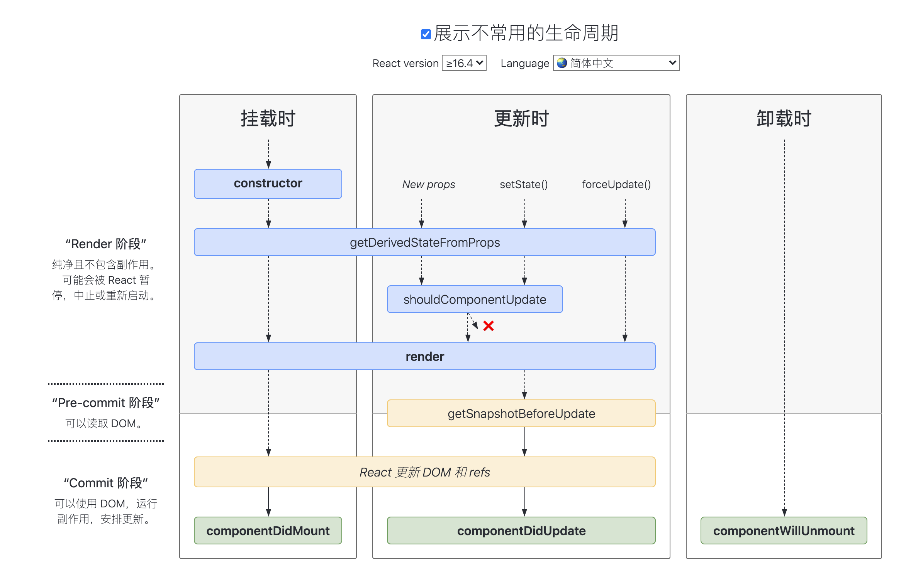

# React 基础

[[toc]]

## JSX

- JSX 是一个模板语法，然后转成 js 对象，在变成真实的 DOM；
- react 没有 vue 中的动态数据，只有大括号
- class 写成 className
- Babel 会把 JSX 转译成一个名为 React.createElement() 函数调用，在 render 函数里可以直接返回 React.createElement ()
- 列表渲染 map 和 key
- `dangerouslySetInnerHTML` = {{`__html`:item}}
- label 中 for 会被认为是 for 循环的 for，所哟需要替换为 htmlFor

## 如何对参数做校验

PropType 和 DefaultProps 直接使用 PropTypes

```js
import PropTypes from 'prop-types';
TodoItem.propTypes = { content: PropTypes.string };
// 还可以写成
PropTypes.oneOfType(PropTypes.string, PropTypes.number);
```

> 需要安装 prop-types 插件

## 规则写法

组件开头必须大写；

注释：`{/* */}`；

解构赋值的写法；

```js
render(){
  const {content}=this.props.content
}
```

react 是视图层的框架

Props,State,render 函数当组件的 Props 或 State 发生改变，render 函数就会重新执行；当父函数的 render 被运行时，它的子组件的 render 都将被运行一次；

ajax 的模块：axios

## 虚拟 DOM

虚拟 DOM 就是一个 js 对象，用来描述真实的 DOM 找到新的虚拟 DOM 和原始的虚拟 DOM 的区别，然后替换真实 DOM

虚拟 dom 中的 diff 算法。同级比对，只比对一层。 key 值的重要性，给虚拟 DOM 的比对，以 key 值做关联，方便比对，所有 key 值不要是 index，

## ref

- 建议不要用 ref，不要直接操作 DOM；
- 在 function 中的 e.target 获取到元素对应的节点；
- ref 也可以获取一个节点，ref={(input)={this.input=input}}接受一个箭头函数；
- input 就是实际的 DOM 元素 ref 会出各种问题，因为 setState()是一个异步函数，每次调用它时它不会立即执行，等一段时间才会执行；解决方法，setState()可以传入第二个参数，第二个参数是个回调函数，setState 更新后才会执行；若果要使用 ref 操作 dom，应该放到该阶段

## 生命周期函数


展示不常用的生命周期：



> 地址：[react-lifecycle](http://projects.wojtekmaj.pl/react-lifecycle-methods-diagram/)

### constructor

```js
import React from 'react';
class Counter extends React.Component {
  state = {
    count: 0,
  };

  // 类属性第三阶段提案
  handleClick = () => {
    // do some stuff
  };
  render() {
    return null;
  }
}
```

社区中去除 constructor 的原因非常明确：

- constructor 中并不推荐去处理初始化以外的逻辑；
- 本身 constructor 并不属于 React 的生命周期，它只是 Class 的初始化函数；
- 通过移除 constructor，代码也会变得更为简洁。

### getDerivedStateFromProps

本函数的作用是使组件在 props 变化时更新 state，它的触发时机是：

- 当 props 被传入时；
- state 发生变化时；
- forceUpdate 被调用时。

依据官方的说法，它的使用场景是很有限的。有太多错误使用的案例。

### getSnapshotBeforeUpdate

getSnapshotBeforeUpdate 方法是配合 React 新的异步渲染的机制，在 DOM 更新发生前被调用，返回值将作为 componentDidUpdate 的第三个参数。

```js
class ScrollingList extends React.Component {
  constructor(props) {
    super(props);
    this.listRef = React.createRef();
  }

  getSnapshotBeforeUpdate(prevProps, prevState) {
    // Are we adding new items to the list?
    // Capture the scroll position so we can adjust scroll later.
    if (prevProps.list.length < this.props.list.length) {
      const list = this.listRef.current;
      return list.scrollHeight - list.scrollTop;
    }
    return null;
  }

  componentDidUpdate(prevProps, prevState, snapshot) {
    // If we have a snapshot value, we've just added new items.
    // Adjust scroll so these new items don't push the old ones out of view.
    // (snapshot here is the value returned from getSnapshotBeforeUpdate)
    if (snapshot !== null) {
      const list = this.listRef.current;
      list.scrollTop = list.scrollHeight - snapshot;
    }
  }

  render() {
    return <div ref={this.listRef}>{/* ...contents... */}</div>;
  }
}
```

## 事件

### React 事件为何 bind this

```js
constructor(props){
  super(props)
  this.handleClick = this.handleClick.bind(this);
}

// 或者
// onClick='handleClick.bind(this)'

// 静态方法，this指向当前实例
handleClick =()=>{
  this.setState()
}
```

- 事件写法 onClick

### event 参数

JSX 上写的事件并没有绑定在对应的真实 DOM 上，而是通过事件代理的方式，将所有的事件都统一绑定在了 `document` 上。这样的方式不仅减少了内存消耗，还能在组件挂载销毁时统一订阅和移除事件。

另外冒泡到 `document` 上的事件也不是原生浏览器事件，而是 React 自己实现的合成事件 `SyntheticEvent`。并模拟出了 DOM 事件的所有能力。

- event.stopPropagation
- event.preventDefault
- event.currentTarget
- event.target

> 获取原生事件用 event.nativeEvent，用 event.nativeEvent.currentTarget（绑定的事件） 取到的是 document

### 自定义参数

方法中接收参数时，最后可追加一个参数，为 event

## Context 上下文

场景

- 公共信息
- 用 props 太繁琐
- 用 redux 小题大做

```js
// 创建 Context 实例
const ThemeContext = React.createContext('light');

class App extends React.Component {
  render() {
    return (
      // 提供 `Provider` 上下文容器
      <ThemeContext.Provider value='dark'>
        <Toolbar />
      </ThemeContext.Provider>
    );
  }
}

// 返回 Toobar 组件函数
function Toolbar(props) {
  return (
    <div>
      <ThemedButton />
    </div>
  );
}

// 构建组件实例
class ThemedButton extends React.Component {
  static contextType = ThemeContext;
  render() {
    return <Button theme={this.context} />;
  }
}
```

## 函数式组件

```js
function Welcome(props) {
  return <h1>Hello, {props.name}</h1>;
}
```

class 组件

```js
class Welcome extends React.Component {
  render() {
    return <h1>Hello, {this.props.name}</h1>;
  }
}
```

## 受控组件

```js
return (
  <div>
    <p>{this.state.name}</p>
    <label htmlFor='inputName'>姓名：</label> {/* 用 htmlFor 代替 for */}
    <input id='inputName' value={this.state.name} onChange={this.onInputChange} />
  </div>
);
```

- 受控组件的意思是说，input 中的值受 state 的控制
- textarea、select 也是基于 value 去写的

## 非受控组件

### ref 和 defaultValue

```js{5,9,18}
class NameForm extends React.Component {
  constructor(props) {
    super(props);
    this.handleSubmit = this.handleSubmit.bind(this);
    this.input = React.createRef();
  }

  handleSubmit(event) {
    alert('A name was submitted: ' + this.input.current.value);
    event.preventDefault();
  }

  render() {
    return (
      <form onSubmit={this.handleSubmit}>
        <label>
          Name:
          <input defaultValue='Bob' type='text' ref={this.input} />
        </label>
        <input type='submit' value='Submit' />
      </form>
    );
  }
}
```

- input 中的值不受 state 的控制
- 默认值可以用 defaultValue 和 defaultCheched 去写

### 手动操作 DOM 元素

- 必须手动操作 DOM，setState 实现不了的，就必须用非受控组件

- 如文件长传组件，需要拿到文件信息的，必须用非受控组件
- 某些富文本编辑器

### 受控组件和非受控组件

- 优先使用受控组件
- 必须操作 DOM，使用非受控组件

## StrictMode

```jsx
ReactDOM.render(
  <React.StrictMode>
    <App />
  </React.StrictMode>,
  document.getElementById('root')
);
```

- 识别具有不安全生命周期的组件
- 有关旧式字符串 ref 用法的警告
- 关于已弃用的 findDOMNode 用法的警告
- 检测意外的副作用
- 检测遗留 context API
