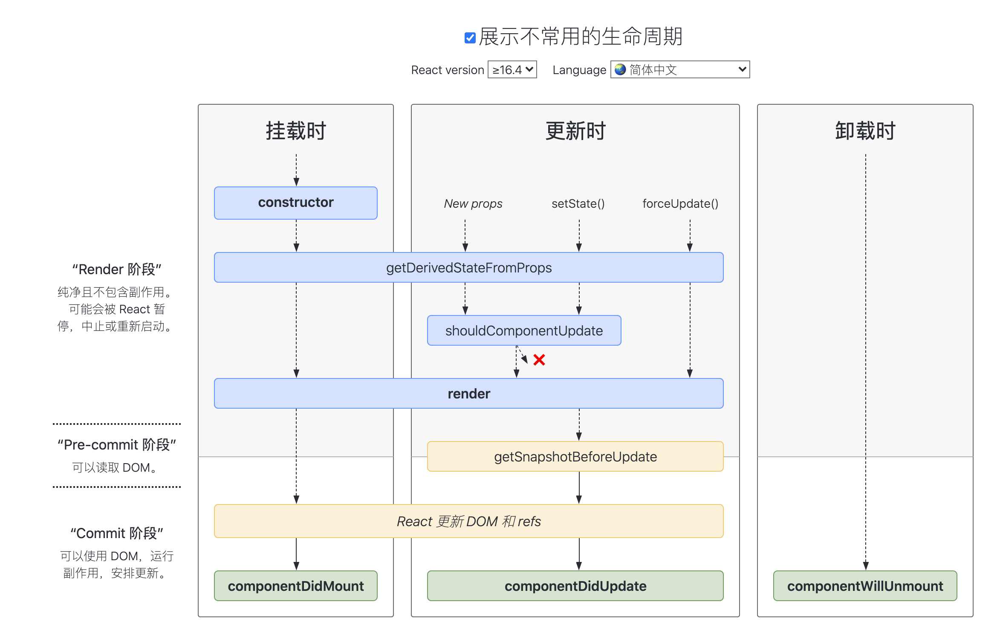

# react 生命周期函数


展示不常用的生命周期：



> 地址：[react-lifecycle](http://projects.wojtekmaj.pl/react-lifecycle-methods-diagram/)

## react 的渲染阶段

## 类组件

### constructor

```js
import React from 'react';
class Counter extends React.Component {
  state = {
    count: 0,
  };

  // 类属性第三阶段提案
  handleClick = () => {
    // do some stuff
  };
  render() {
    return null;
  }
}
```

社区中去除 constructor 的原因非常明确：

- constructor 中并不推荐去处理初始化以外的逻辑；
- 本身 constructor 并不属于 React 的生命周期，它只是 Class 的初始化函数；
- 通过移除 constructor，代码也会变得更为简洁。

### getDerivedStateFromProps

本函数的作用是使组件在 props 变化时更新 state，它的触发时机是：

- 当 props 被传入时；
- state 发生变化时；
- forceUpdate 被调用时。

依据官方的说法，它的使用场景是很有限的。有太多错误使用的案例。

### getSnapshotBeforeUpdate

getSnapshotBeforeUpdate 方法是配合 React 新的异步渲染的机制，在 DOM 更新发生前被调用，返回值将作为 componentDidUpdate 的第三个参数。

```js
class ScrollingList extends React.Component {
  constructor(props) {
    super(props);
    this.listRef = React.createRef();
  }

  getSnapshotBeforeUpdate(prevProps, prevState) {
    // Are we adding new items to the list?
    // Capture the scroll position so we can adjust scroll later.
    if (prevProps.list.length < this.props.list.length) {
      const list = this.listRef.current;
      return list.scrollHeight - list.scrollTop;
    }
    return null;
  }

  componentDidUpdate(prevProps, prevState, snapshot) {
    // If we have a snapshot value, we've just added new items.
    // Adjust scroll so these new items don't push the old ones out of view.
    // (snapshot here is the value returned from getSnapshotBeforeUpdate)
    if (snapshot !== null) {
      const list = this.listRef.current;
      list.scrollTop = list.scrollHeight - snapshot;
    }
  }

  render() {
    return <div ref={this.listRef}>{/* ...contents... */}</div>;
  }
}
```

### PureComponent

PureComponent 默认实现了 shouldComponentUpdate 函数。所以仅在 props 与 state 进行浅比较后，确认有变更时才会触发重新渲染。

### 如何避免生命周期中的坑

避免生命周期中的坑需要做好两件事：不在恰当的时候调用了不该调用的代码；在需要调用时，不要忘了调用。主要有这么 7 种情况容易造成生命周期的坑。

- getDerivedStateFromProps 容易编写反模式代码，使受控组件与非受控组件区分模糊。
- componentWillMount 在 React 中已被标记弃用，不推荐使用，主要原因是新的异步渲染架构会导致它被多次调用。所以网络请求及事件绑定代码应移至 componentDidMount 中。
- componentWillReceiveProps 同样被标记弃用，被 getDerivedStateFromProps 所取代，主要原因是性能问题。
- shouldComponentUpdate 通过返回 true 或者 false 来确定是否需要触发新的渲染。主要用于性能优化。
- componentWillUpdate 同样是由于新的异步渲染机制，而被标记废弃，不推荐使用，原先的逻辑可结合 getSnapshotBeforeUpdate 与 componentDidUpdate 改造使用。
- 如果在 componentWillUnmount 函数中忘记解除事件绑定，取消定时器等清理操作，容易引发 bug。
- 如果没有添加错误边界处理，当渲染发生异常时，用户将会看到一个无法操作的白屏，所以一定要添加。

### React 的请求应该放在哪里

- constructor：可以放，但从设计上而言不推荐。constructor 主要用于初始化 state 与函数绑定，并不承载业务逻辑。而且随着类属性的流行，constructor 已经很少使用了。
- componentWillMount：已被标记废弃，在新的异步渲染架构下会触发多次渲染，容易引发 Bug，不利于未来 React 升级后的代码维护。

所以React 的请求放在 componentDidMount 里是最好的选择。
