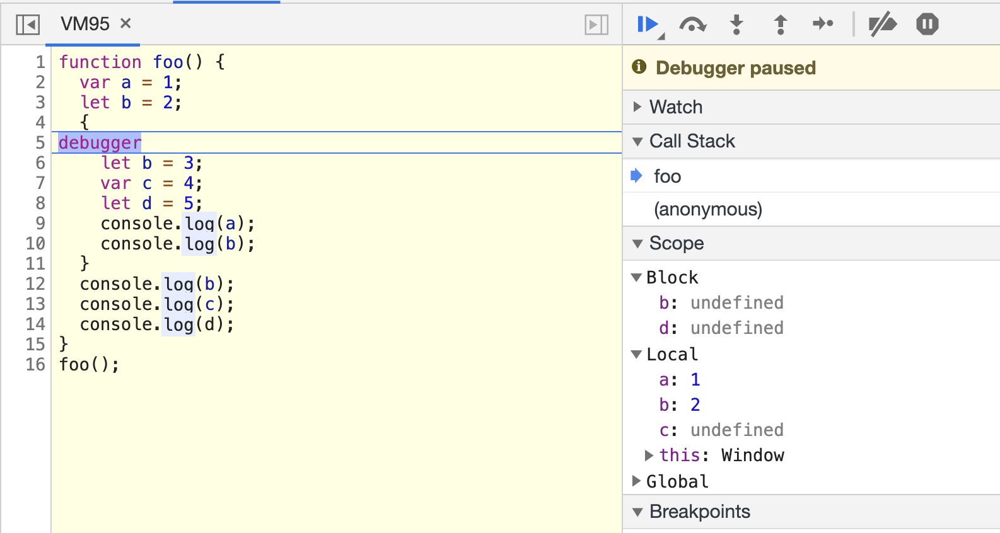

# JavaScript 的执行机制

## 变量提升


- 在编译阶段，变量和函数会被存放到变量环境中，变量的默认值会被设置为 undefined；在代码执行阶段，JavaScript 引擎会从变量环境中去查找自定义的变量和函数。
- 执行上下文是 JavaScript 执行一段代码时的运行环境，比如调用一个函数，就会进入这个函数的执行上下文，确定该函数在执行期间用到的诸如 this、变量、对象以及函数等。

## 调用栈


- 除了通过断点来查看调用栈，你还可以使用 console.trace()
- 栈是有容量限制的，超过最大数量后就会出现栈溢出的错误。

> 栈是一种非常重要的数据结构，不光应用在 JavaScript 语言中，其他的编程语言，如 C/C++、Java、Python 等语言，在执行过程中也都使用了栈来管理函数之间的调用关系。所以栈是非常基础且重要的知识点，你必须得掌握。

## 块级作用域

变量提升所带来的问题:

1. 变量容易在不被察觉的情况下被覆盖掉
2. 本应销毁的变量没有被销毁

```js
function foo() {
  for (var i = 0; i < 7; i++) {}
  console.log(i);
}
foo();
```

## let 和 const

```js
function foo() {
  var a = 1;
  let b = 2;
  {
    let b = 3;
    var c = 4;
    let d = 5;
    console.log(a); //1
    console.log(b); //3
  }
  console.log(b); //2
  console.log(c); //4
  console.log(d); //d is not defined
}
foo();
```



- 函数内部通过 var 声明的变量，在编译阶段全都被存放到变量环境里面了。
- 通过 let 声明的变量，在编译阶段会被存放到词法环境（Lexical Environment）中。
- **在函数作用域内部的块作用域，通过 let 声明的变量并没有被存放到词法环境中。**
- 编译阶段的变量提升依然存在

## 作用域链

其实在每个执行上下文的变量环境中，都包含了一个外部引用，用来指向外部的执行上下文，我们把这个外部引用称为 outer。

当一段代码使用了一个变量时，JavaScript 引擎首先会在“当前的执行上下文”中查找该变量，找不到时会去外层作用域一层一层的去找。

**词法作用域：** 是指作用域是由代码中函数声明的位置来决定的，所以词法作用域是静态的作用域，通过它就能够预测代码在执行过程中如何查找标识符。词法作用域是代码阶段就决定好的，和函数是怎么调用的没有关系。

## 闭包


在 JavaScript 中，根据词法作用域的规则，内部函数总是可以访问其外部函数中声明的变量，当通过调用一个外部函数返回一个内部函数后，即使该外部函数已经执行结束了，但是内部函数引用外部函数的变量依然保存在内存中，我们就把这些变量的集合称为闭包。比如外部函数是 foo，那么这些变量的集合就称为 foo 函数的闭包。

如果引用闭包的函数是个局部变量，等函数销毁后，在下次 JavaScript 引擎执行垃圾回收时，判断闭包这块内容如果已经不再被使用了，那么 JavaScript 引擎的垃圾回收器就会回收这块内存。

如果该闭包会一直使用，那么它可以作为全局变量而存在；但如果使用频率不高，而且占用内存又比较大的话，那就尽量让它成为一个局部变量。

## this

执行上下文主要分为三种——全局执行上下文、函数执行上下文和 eval 执行上下文，所以对应的 this 也只有这三种——全局执行上下文中的 this、函数中的 this 和 eval 中的 this。

this 的设计缺陷以及应对方案：

**1. 嵌套函数中的 this 不会从外层函数中继承**

```js
var myObj = {
  name: '极客时间',
  showThis: function() {
    console.log(this);
    function bar() {
      console.log(this); // 指向 Window
    }
    bar();
  }
};
myObj.showThis();
```

解决方法：

- 第一种是把 this 保存为一个 self 变量，再利用变量的作用域机制传递给嵌套函数。
- 第二种是继续使用 this，但是要把嵌套函数改为箭头函数，因为箭头函数没有自己的执行上下文，所以它会继承调用函数中的 this。

**2. 普通函数中的 this 默认指向全局对象 window**

这个设计也是一种缺陷，因为在实际工作中，我们并不希望函数执行上下文中的 this 默认指向全局对象，因为这样会打破数据的边界，造成一些误操作。

这个问题可以通过设置 JavaScript 的“严格模式”来解决。在严格模式下，默认执行一个函数，其函数的执行上下文中的 this 值是 undefined。
