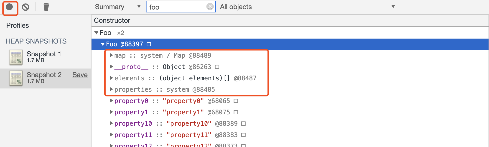

# JavaScript 设计思想篇

## 函数

- JavaScript 中的函数就是一种特殊的对象，我们把 JavaScript 中的函数称为一等公民 (First Class Function)

- 基于函数是一等公民的设计，使得 JavaScript 非常容易实现一些特性，比如闭包，还有函数式编程等，而其他语言要实现这些特性就显得比较困难，比如要在 C++ 中实现闭包需要实现大量复杂的代码，而且使用起来也异常复杂。

### JavaScript 中的对象

JavaScript 中大部分的内容都是由对象构成的，如函数、数组，也可以说 JavaScript 是建立在对象之上的语言。

虽然 JavaScript 是基于对象设计的，但是它却不是一门面向对象的语言 (Object-Oriented Programming Language)，因为面向对象语言天生支持封装、继承、多态，但是 JavaScript 并没有直接提供多态的支持

**每个对象就是由一组组属性和值构成的集合** ，对象的值可以是任意类型的数据

### 函数的本质

函数是一种特殊的对象，它和对象一样可以拥有属性和值，但是函数和普通对象不同的是，函数可以被调用。

V8 内部的实现：

- 函数除了可以拥有常用类型的属性值之外，还拥有两个隐藏属性，分别是 name 属性和 code 属性。
- 当执行到一个函数调用语句时，V8 便会从函数对象中取出 code 属性值，也就是函数代码，然后再解释执行这段函数代码。

## 快属性和慢属性

> [fast-properties](https://v8.dev/blog/fast-properties)

- V8 在对象中添加了两个隐藏属性，排序属性 elements 和常规属性 properties。
- properties 有分了「快属性」和「慢属性」。快属性(10 个)保存在线性数据结构中，慢属性保存在独立的非线性数据结构 (词典)中。
- 除了 elements 和 properties 属性，V8 还为每个对象实现了 map 属性和 `__proto__` 属性。

> 我们将保存在线性数据结构中的属性称之为“快属性”，因为线性数据结构中只需要通过索引即可以访问到属性，虽然访问线性结构的速度快，但是如果从线性结构中添加或者删除大量的属性时，则执行效率会非常低，这主要因为会产生大量时间和内存开销。

在 Chrome Memory 中查看。

> 通常，我们不建议使用 delete 来删除属性
