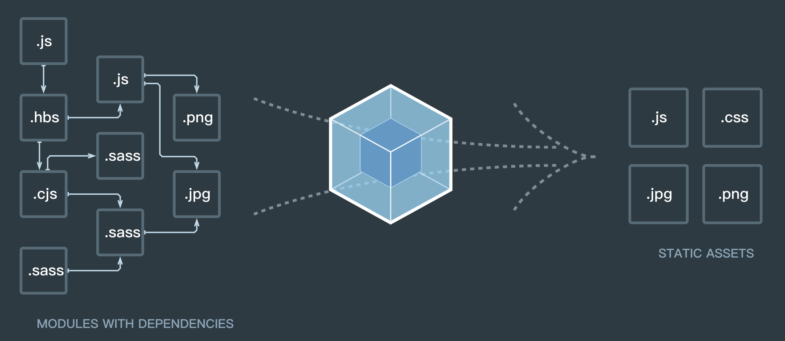

# Webpack 运行原理

学习 Webpack 需要理解四个核心概念：入口(entry)， 输出(output)，加载器(loader)，插件(plugins)



首页图中的左中右三个部分对应 module chunk bundle

- module 是各源码文件，webpack 中一切皆模块；
- chunk 多模块的合成的，entry、import()、splitchunk。（类似于一个内存中的概念，还没输出）
- bundle 最终输出的文件

## 多入口

```js
entry: {
  // 两个入口代表打出来的两个包
  index: path.join(srcPath, 'index.js'),
  other: path.join(srcPath, 'other.js')
},
output: {
  filename: '[name].[contentHash:8].js', // name 即多入口时 entry 的 key
},
plugins: [
  // 多入口 - 生成 index.html
  new HtmlWebpackPlugin({
    template: path.join(srcPath, 'index.html'),
    filename: 'index.html',
    // chunks 表示该页面要引用哪些 chunk （即上面的 index 和 other），默认全部引用
    chunks: ['index']  // 只引用 index.js
  }),
  // 多入口 - 生成 other.html
  new HtmlWebpackPlugin({
    template: path.join(srcPath, 'other.html'),
    filename: 'other.html',
    chunks: ['other']  // 只引用 other.js
  })
]
```

如果 html 文件没有需要引入的 js，不需要配置多入口，只需要 HtmlWebpackPlugin 插件即可。

```js
new HtmlWebpackPlugin({
    filename: 'app-download.html',
    template: 'app-download.ejs',
    inject: false
}),
```

## 加载器(Loader)

由于 webpack 只能理解 JavaScript 和 JSON 文件，所以我们需要对一些非 js 文件处理成 webpack 能够处理的模块，比如 sass 文件。我们可以把 loader 理解为是一个转换器，负责把某种文件格式的内容转换成 webpack 可以支持打包的模块。本质上，webpack loader 将所有类型的文件，转换为应用程序的依赖图和 bundle 可以直接引用的模块。

loader 能够 import 导入任何类型的模块（例如 .css 文件），这是 webpack 特有的功能，其他打包程序或任务执行器的可能并不支持。我们认为这种语言扩展是很有必要的，因为这可以使开发人员创建出更准确的依赖关系图。

对一个单独的 module 对象定义了 rules 属性，里面包含两个必须属性：test 和 use。

- test: 表示需要检索的文件类型
- use: 指定配置文件 loader 选项，可以通过数组关联多个。

## 插件(Plugins)

Loaders 将各类型的文件处理成 webpack 能够处理的模块， plugins 有着很强的能力。插件的范围包括，从打包优化和压缩，一直到重新定义环境中的变量，插件接口功能极其强大，可以用来处理各种各样的任务。

多数插件可以通过选项 (option) 自定义。你也可以在一个配置文件中因为不同目的而多次使用同一个插件，这时需要通过使用 new 操作符来创建它的一个实例。

## Chunk

coding split 的产物，我们可以对一些代码打包成一个单独的 chunk，比如某些公共模块，去重，更好的利用缓存。或者按需加载某些功能模块，优化加载时间。在 webpack3 及以前我们都利用 CommonsChunkPlugin 将一些公共代码分割成一个 chunk，实现单独加载。在 webpack4 中 CommonsChunkPlugin 被废弃，使用 SplitChunksPlugin

## webpack 内部工作流程

> [探究 webpack 内部工作流程](https://juejin.im/book/5a6abad5518825733c144469/section/5a6abcdc51882535a5546e8e)

抛开复杂的 loader 和 plugin 机制，webpack 本质上就是一个 JS Module Bundler

### bundler 的基础流程

首先，bundler 从一个构建入口出发，解析代码，分析出代码模块依赖关系，然后将依赖的代码模块组合在一起，在 JavaScript bundler 中，还需要提供一些胶水代码让多个代码模块可以协同工作，相互引用。

```js
// entry.js
import { bar } from './bar.js' // 依赖 ./bar.js 模块

// bar.js
const foo = require('./foo.js') // 依赖 ./foo.js 模块
```

bundler 需要从这个入口代码（第一段）中解析出依赖 bar.js，然后再读取 bar.js 这个代码文件，解析出依赖 foo.js 代码文件，继续解析其依赖，递归下去，直至没有更多的依赖模块，最终形成一颗模块依赖树。

分析出依赖关系后，bunlder 需要将依赖关系中涉及的所有文件组合到一起，但由于依赖代码的执行是有先后顺序以及会引用模块内部不同的内容，不能简单地将代码拼接到一起。
