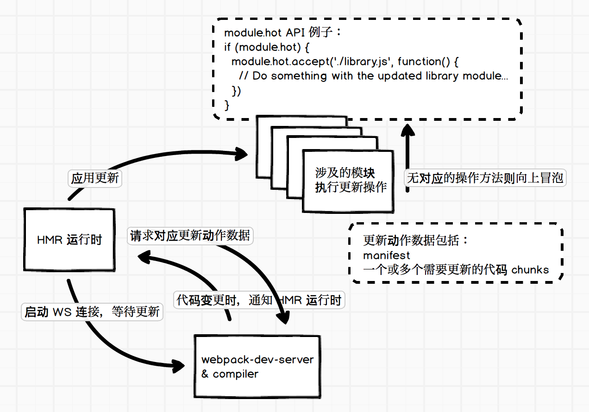

# webpack 基础

> [文档](https://www.webpackjs.com/concepts/)

## 基础

### npm 运行

package.json 配置后，运行时会去 node_modules/.bin 目录中区

### Webpack 的本质

Webpack 可以将其理解是一种基于事件流的编程范例，一系列的插件运行。

### Output

Output ⽤来告诉 webpack 如何将编译后的⽂件输出到磁盘

```js
module.exports = {
  entry: './path/to/my/entry/file.js'
  output: {
    filename: 'bundle.js’,
    path: __dirname + '/dist'
  }
};
```

### Loaders

本身是一个函数，接受源文件作为参数，返回转换的结果。

- bable-loader
- css-loader
- less-loader
- ts-loader
- file-loader
- raw-loader
- thread-loader

```js
const path = require('path')
module.exports = {
  output: {
    filename: 'bundle.js',
  },
  module: {
    rules: [{ test: /\.txt$/, use: 'raw-loader' }],
  },
}
```

### Plugins

插件⽤于 bundle ⽂件的优化，资源管理和环境变量注⼊。作⽤于整个构建过程，从构建开始到构建结束。

- HtmlWebpackPlugin
- DefinePlugin
- copy-webpack-plugin
- extract-text-webpack-plugin
- ProvidePlugin
- IgnorePlugin

> [webpack-contrib](https://github.com/webpack-contrib/awesome-webpack)

### Mode

Mode ⽤来指定当前的构建环境是：production、development 还是 none。设置 mode 可以使⽤ webpack 内置的函数，默认值为 production

## 基础例子

### 解析 ES6

- 使⽤ babel-loader
- babel-loader 依赖于 babel 的配置⽂件是：.babelrc
- 增加 ES6 的 babel preset 配置

> 解析 es6 需要安装@bable/core @bable/preset-env @bable-loader

### webpack 中的⽂件监听

webpack 开启监听模式，有两种⽅式：

- 启动 webpack 命令时，带上 --watch 参数
- 在配置 webpack.config.js 中设置 watch: true

```json{3}
"scripts": {
  "build": "webpack ",
+ "watch": "webpack --watch"
}
```

**⽂件监听的原理分析**

轮询判断⽂件的最后编辑时间是否变化。某个⽂件发⽣了变化，并不会⽴刻告诉监听者，⽽是先缓存起来，等 aggregateTimeout

```js
module.export = {
  //默认 false，也就是不开启
  watch: true,
  //只有开启监听模式时，watchOptions才有意义
  wathcOptions: {
    //默认为空，不监听的文件或者文件夹，支持正则匹配
    ignored: /node_modules/,
    //监听到变化发生后会等300ms再去执行，默认300ms
    aggregateTimeout: 300,
    //判断文件是否发生变化是通过不停询问系统指定文件有没有变化实现的，默认每秒问1000次
    poll: 1000,
  },
}
```

### 热更新

#### webpack-dev-server

- WDS 不刷新浏览器
- WDS 不输出⽂件，⽽是放在内存中
- 使⽤ HotModuleReplacementPlugin 插件
- webpack-dev-server 的 proxy 功能是使用 `http-proxy-middleware` 来实现的

#### webpack-dev-middleware(使用比较多)

webpack-dev-middleware 就是在 Express 中提供 webpack-dev-server 静态服务能力的一个中间件，我们可以很轻松地将其集成到现有的 Express 代码中去，就像添加一个 Express 中间件那么简单。

#### HMR

> 没有看懂，有待研究

HMR 全称是 Hot Module Replacement，即模块热替换。HMR 既避免了频繁手动刷新页面，也减少了页面刷新时的等待。局部替换掉部分模块代码并且使其生效。

安装好 webpack-dev-server， 添加一些简单的配置，即在 webpack 的配置文件中添加启用 HMR 需要的两个插件：

```js
  new webpack.NamedModulesPlugin(), // 用于启动 HMR 时可以显示模块的相对路径
  new webpack.HotModuleReplacementPlugin(), // Hot Module Replacement 的插件
```

首先我们要知道一个概念：webpack 内部运行时，会维护一份用于管理构建代码时各个模块之间交互的表数据，webpack 官方称之为 Manifest，其中包括入口代码文件和构建出来的 bundle 文件的对应关系。可以使用 WebpackManifestPlugin 插件来输出这样的一份数据。



- Webpack Compile: 将 JS 编译成 Bundle
- HMR Server: 将热更新的⽂件输出给 HMR Rumtime
- Bundle server: 提供⽂件在浏览器的访问
- HMR Rumtime: 会被注⼊到浏览器，
- 更新⽂件的变化
- bundle.js: 构建输出的⽂件。

### 文件指纹

- Hash：和整个项⽬的构建相关，只要项⽬⽂件有修改，整个项⽬构建的 hash 值就会更改
- Chunkhash：和 webpack 打包的 chunk 有关，不同的 entry 会⽣成不同的 chunkhash 值。一般 js 会用 Chunkhash
- Contenthash：根据⽂件内容来定义 hash ，⽂件内容不变，则 contenthash 不变。css 文件一般用 Contenthash

```js{2,7}
output: {
  filename: '[name][chunkhash:8].js',
  path: __dirname + '/dist'
},
plugins: [
  new MiniCssExtractPlugin({
    filename: `[name][contenthash:8].css`
  })
]
```
