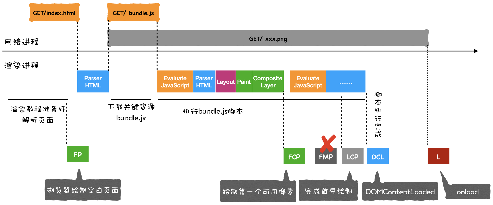

# 浏览器中的页面

[[toc]]

## 渲染流程

> 流水线可分为如下几个子阶段：构建 DOM 树、样式计算、布局阶段、分层、绘制、分块、光栅化和合成

- 渲染进程将 HTML 内容转换为能够读懂的 DOM 树结构。
- 渲染引擎将 CSS 样式表转化为浏览器可以理解的 styleSheets，计算出 DOM 节点的样式。
- 创建布局树，并计算元素的布局信息。
- 对布局树进行分层，并生成分层树。
- 为每个图层生成绘制列表，并将其提交到合成线程。
- 合成线程将图层分成图块，并在光栅化线程池中将图块转换成位图。
- 合成线程发送绘制图块命令 DrawQuad 给浏览器进程。
- 浏览器进程根据 DrawQuad 消息生成页面，并显示到显示器上。

::: details 渲染流程

:::

### 分层

页面中有很多复杂的效果，如一些复杂的 3D 变换、页面滚动，或者使用 z-indexing 做 z 轴排序等，为了更加方便地实现这些效果，渲染引擎还需要为特定的节点生成专用的图层，并生成一棵对应的图层树（LayerTree）

> 可以在 Chrome 的“开发者工具”，选择“Layers”标签查看

- 拥有[层叠上下文](https://developer.mozilla.org/zh-CN/docs/Web/Guide/CSS/Understanding_z_index/The_stacking_context)属性的元素会被提升为单独的一层。
- 需要剪裁（clip）的地方也会被创建为图层

### 图层绘制

“开发者工具”的“Layers”标签，选择“document”层，来实际体验下绘制列表

### 栅格化（raster）操作

- 绘制列表只是用来记录绘制顺序和绘制指令的列表，而实际上绘制操作是由渲染引擎中的合成线程来完成的。
- 合成线程会按照视口附近的图块来优先生成位图，实际生成位图的操作是由栅格化来执行的。所谓栅格化，是指将图块转换为位图。
- 栅格化过程都会使用 GPU 来加速生成，使用 GPU 生成位图的过程叫快速栅格化，或者 GPU 栅格化，生成的位图被保存在 GPU 内存中。

### 相关概念

- 重排需要更新完整的渲染流水线，所以开销也是最大的。
- 重绘省去了布局和分层阶段，所以执行效率会比重排操作要高一些。
- 使用了 CSS 的 transform 来实现动画效果，这可以避开重排和重绘阶段，直接在非主线程上执行合成动画操作。

### 分层和合成机制(扩展)

- 显示器以每秒 60s 速度从前显示器读取前缓冲区的图片；
- 显卡合成新的图像，并将图像保存到后缓冲区中。
- 渲染流水线生成的每一副图片称为一帧。
- 通常渲染引擎生成一帧图像有三种方式：重排、重绘和合成。其中重排和重绘操作都是在渲染进程的主线程上执行的，比较耗时；而合成操作是在渲染进程的合成线程上执行的，执行速度快，且不占用主线程。
- 渲染引擎会通过合成线程直接去处理变换，这些变换并没有涉及到主线程，这样就大大提升了渲染的效率。这也是 CSS 动画比 JavaScript 动画高效的原因。

## JavaScript 是如何影响 DOM 树构建的

HTML 解析器并不是等整个文档加载完成之后再解析的，而是网络进程加载了多少数据，HTML 解析器便解析多少数据。网络进程和渲染进程之间会建立一个共享数据的管道

解析到 `<script>` 标签时，渲染引擎判断这是一段脚本，此时 HTML 解析器就会暂停 DOM 的解析，因为接下来的 JavaScript 可能要修改当前已经生成的 DOM 结构。

如过 JavaScript 脚本是外部文件，JavaScript 文件的下载过程会阻塞 DOM 解析，而通常下载又是非常耗时的，会受到网络环境、JavaScript 文件大小等因素的影响。以下是优化方案：

### 预解析操作

当渲染引擎收到字节流之后，会开启一个预解析线程，用来分析 HTML 文件中包含的 JavaScript、CSS 等相关文件，解析到相关文件之后，预解析线程会提前下载这些文件。

### async 和 defer

async 和 defer 虽然都是异步的，不过还有一些差异，使用 async 标志的脚本文件一旦加载完成，会立即执行；而使用了 defer 标记的脚本文件，需要在 DOMContentLoaded 事件之前执行。

### css 和 JS 同时存在的问题

JavaScript 引擎在解析 JavaScript 之前，是不知道 JavaScript 是否操纵了 CSSOM 的，所以渲染引擎在遇到 JavaScript 脚本时，不管该脚本是否操纵了 CSSOM，都会执行 CSS 文件下载，解析操作，再执行 JavaScript 脚本。

::: tip 结论：

CSS 不阻塞 js 的加载，但是会阻塞 js 的执行；

:::

## CSS 如何影响首次加载时的白屏时间

不管 CSS 文件和 JavaScript 文件谁先到达，都要先等到 CSS 文件下载完成并生成 CSSOM，然后再执行 JavaScript 脚本，最后再继续构建 DOM，构建布局树，绘制页面。

**优化：** 对于大的 CSS 文件，可以通过媒体查询属性，将其拆分为多个不同用途的 CSS 文件，这样只有在特定的场景下才会加载特定的 CSS 文件。

## 如何系统地优化页面

> 通常一个页面有三个阶段：加载阶段、交互阶段和关闭阶段。

### 加载阶段

总的优化原则就是减少关键资源个数，降低关键资源大小，降低关键资源的 RTT 次数。

### 交互阶段

1. 减少 JavaScript 脚本执行时间
2. 避免强制同步布局
3. 避免布局抖动
4. 合理利用 CSS 合成动画
5. 避免频繁的垃圾回收

## PWA

> PWA 提出了两种解决方案：通过引入 Service Worker 来试着解决离线存储和消息推送的问题，通过引入 manifest.json 来解决一级入口的问题。

- Service Worker 的概念，它的主要思想是在页面和网络之间增加一个拦截器，用来缓存和拦截请求
- manifest.json 配置文件，可以让开发者自定义桌面的图标、显示名称、启动方式等信息，还可以设置启动画面、页面主题颜色等信息。

特点：

- 可靠：弱网环境提供基本的网络访问；
- 快速：对网页渲染和数据访问有很好的优化；
- 融入：引用可以添加到桌面，和普通应用一样有全屏，和推送特性；

## 加载阶段性能：使用 Audits 来优化 Web 性能

Performance 非常强大，因为它为我们提供了非常多的运行时数据，利用这些数据我们就可以分析出来 Web 应用的瓶颈。但是要完全学会其使用方式却是非常有难度的，其难点在于这些数据涉及到了特别多的概念，而这些概念又和浏览器的系统架构、消息循环机制、渲染流水线等知识紧密联系在了一起。

Audtis 简单很多，它将检测到的细节数据隐藏在背后，只提供给我们一些直观的性能数据，同时，还会给我们提供一些优化建议。

首先准备 Chrome Canary 版的浏览器或稳定版浏览器。

需要在 Chrome 的隐身模式下工作，这样可以确保我们安装的扩展、浏览器缓存、Cookie 等数据不会影响到检测结果。

Audits 除了生成性能指标以外，还会分析该站点并提供了很多优化建议

性能指标的分数是由六项指标决定的，它们分别是：

1. 首次绘制 (First Paint)；
2. 首次有效绘制 (First Meaningfull Paint)；
3. 首屏时间 (Speed Index)；
4. 首次 CPU 空闲时间 (First CPU Idle)；
5. 完全可交互时间 (Time to Interactive)；
6. 最大估计输入延时 (Max Potential First Input Delay)。

## 页面性能工具：如何使用 Performance

## 性能分析工具：如何分析 Performance 中的 Main 指标
