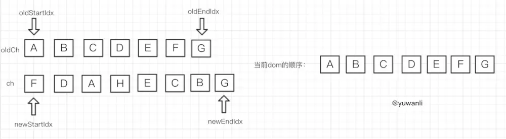
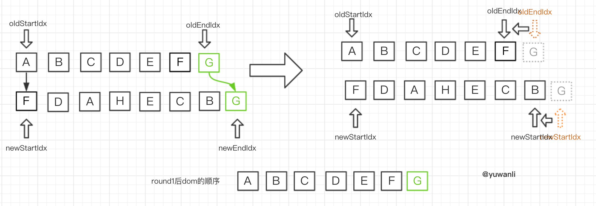
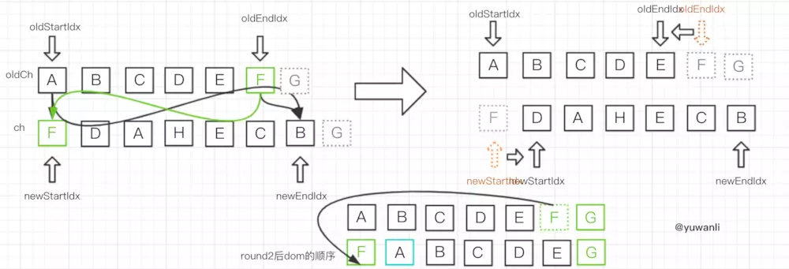
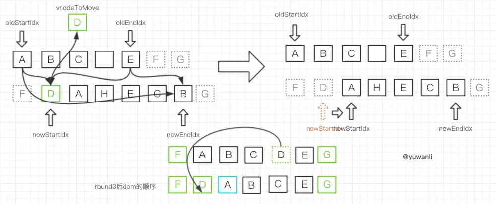
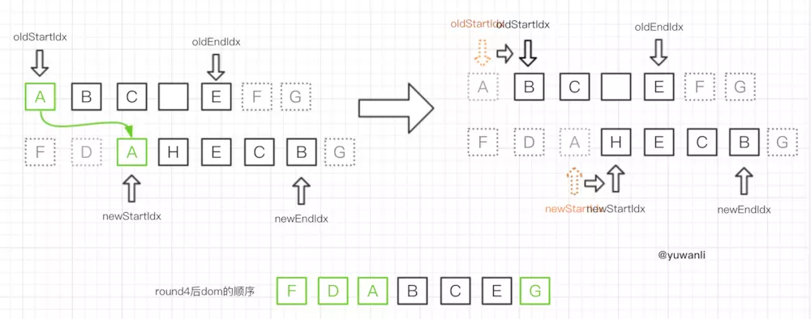

# diff 算法

[Vue 虚拟 DOM 和渲染流程](../Notes/docs1/Vue虚拟DOM和渲染流程)

1.例如，原有的 oldCh 的顺序是 A 、B、C、D、E、F、G，更新后成 ch 的顺序 F、D、A、H、E、C、B、G。

2.按顺序比对头和尾，尾和尾相似，对 G 执行 patchVnode 更新对应 elm，然后指针移动，oldEndIdx--、newEndIdx--

3.按顺序比对头和尾，oldCh 的尾和 ch 的头相似，对 F 执行 patchVnode 更新 elm，找到 oldStartVnode 所在位置前插入 F，然后指针移动，oldEndIdx--、newEndIdx++

4.头尾匹配和交叉匹配都不满足，然后通过 D 的 key，在 oldKeyToIdx 找，找到了对应的 key，对 D 进行 patchVnode，将 oldCh 中的 D 设置为 undefined，再把 D 插入到 oldStartVnode 位置的前面，指针移动 newStartIdx++

5.头和头匹配匹配成功，对 A 进行 patchVnode，然后 oldStartIdx++、newStartIdx++

6.oldCh 的头和 ch 的尾匹配成功，对 B 进行 patchVnode，在 oldEndVnode 的位置后面插入处理过的 B，然后 oldStartIdx++、newEndIdx--

7.和上一步处理相同，对 C 进行 patchVnode，在 dom 中，找到 oldEndVnode，在其位置后面插入处理过的 C，然后 oldStartIdx++、newEndIdx--

8.oldStartVnode 因为之前设置成了 undefined，所以直接移动指针 oldStartIdx++

9.尾和尾匹配成功，对 E 进行 patchVnode，然后 oldEndIdx--、newEndIdx--

10.oldStartIdx > oldEndIdx，循环结束。此时 newStartIdx 到 newEndIdx 之间的部分认为是新增部分，直接调用 addVnodes 插入。相反的，如果 newStartIdx > newEndIdx 循环结束，则 oldStartIdx 与 oldEndIdx 之间的节点认为是需要删除的部分，调用 removeVnodes。

